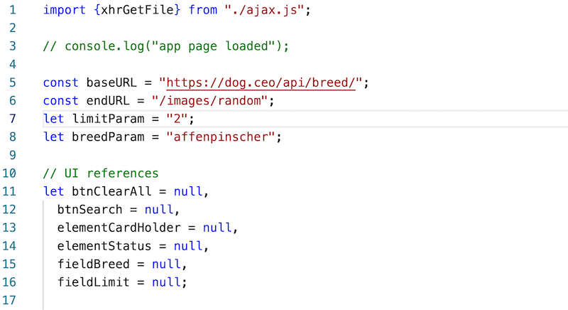
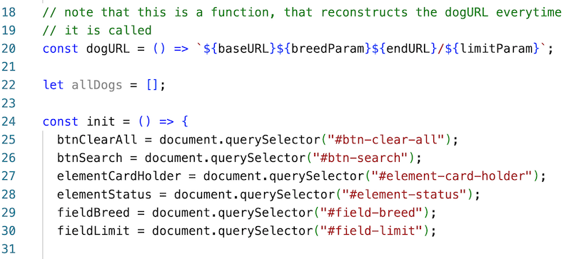
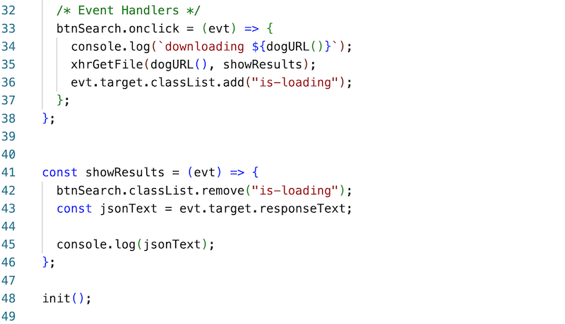
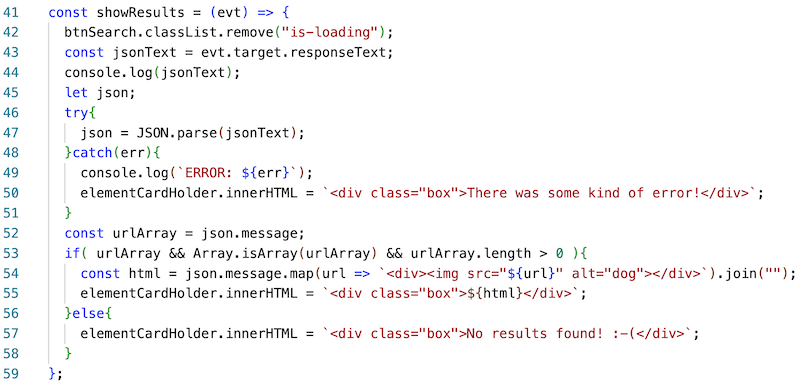
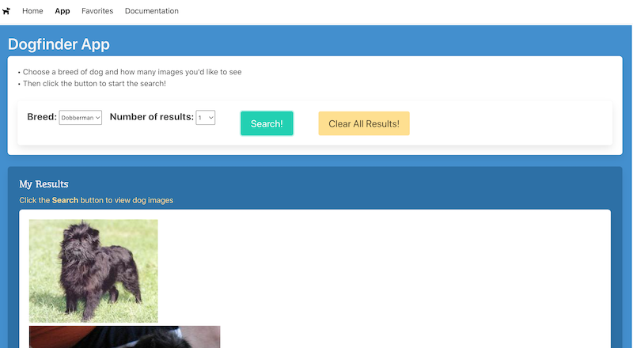
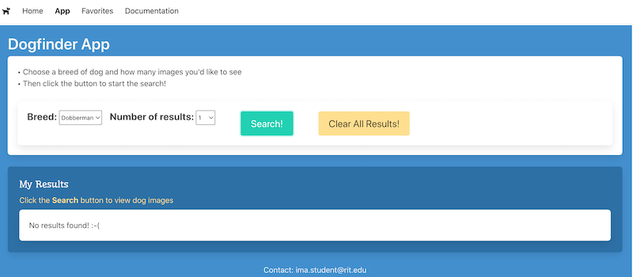

# Dogfinder App - Part II

- Overview: Let's start adding some structured JS and functionality to this app!


## I. Change how you are loading your hamburger code
- Test your hamburger menu code, on all 4 HTML pages, to be sure that it works
- Delete the `<script src="index.js"></script>` tag that's at the bottom of all 4 HTML pages
- Rename **index.js to **hamburger.js**, and move it into your **src/** folder
- Now put the following `<script>` tag up in the `<head>` section of each HTML page

```js
<script defer src="src/hamburger.js"></script>
``` 

- now test all 4 hamburger menus to be sure that they still work
- BTW - the `<script>` tag above could have been `type="module"` instead of `defer`, but it doesn't really mater in that you will eventually be getting rid on **hamburger.js** and putting the hamburger functionality into a nav component instead

<hr>

## II. Add a web component if you don't already have one


**app-footer.js**
```js
const template = document.createElement("template");
template.innerHTML = `
<link rel="stylesheet" href="https://cdn.jsdelivr.net/npm/bulma@0.9.3/css/bulma.min.css">
<div class="has-text-light has-text-centered mt-2"><slot></slot></div>
`;

class AppFooter extends HTMLElement{
  constructor(){
    super();
    this.attachShadow({mode: "open"});
    this.shadowRoot.appendChild(template.content.cloneNode(true));
  }
} 

customElements.define('app-footer', AppFooter);
````

<hr>

## III. Change how you are loading your web components (if necessary)

- Create **src/loader.js** and make it look like this (the exact contents will depend on how you named your components, and/or if you created any for Dogfinder)


**src/loader.js**
```js
import "./app-header.js"; // if you have one
import "./app-footer.js";
```

- Your `<script>` tag should look like this, and will go onto all 4 HTML pages:

```js
<script type="module" src="./src/loader.js"></script>
```

<hr>

## IV. Create **ajax.js**

Let's create a helper JS file called **src/ajax.js** - go ahead and make the contents look like this:

```js
export const xhrGetFile = (url, callback) => {
  const xhr = new XMLHttpRequest();

  xhr.onload = callback;
  xhr.onerror = (evt) => console.log(`ERROR: ${evt}`);
  xhr.open("GET", url);
  xhr.send();
};
```

- BTW - the above code passes muster with ESLint - https://eslint.org/play

<hr>

## V. Create **app.js**

- **app.js** will be responsible for the functionality of the **app.html** page


```js
import {xhrGetFile} from "./ajax.js";

console.log("app page loaded");
```


- And import it in the `<head>` section of **app.html**

```js
<script type="module" src="./src/app.js"></script>
```

- Now test it by heading to the app page in the browser, you should see the log in the console
- Leave the app page and then return to it - the log should fire again - because the page has to reload every time we return to it
- Now add some more code to **app.js**








- Test the app by clicking the Search button - you should see the JSON text logged to the console with an array of urls that point at affenpinscher images (just one image because that's all we asked for)
- Also utilize the debugger to verify that all of your variables that are supposed to be pointing at DOM elements, are doing so
- Watch the button - note how it turns into a "spinner" while it is loading data? It's "letting the user know what's going on!" Bravo! Go ahead and look over the code and see how/where that's happening

## VI. Display the dog images

1) Change the `limitParam` above to `"2"`

2) Write code that turns `jsonText` into a object we can parse. Do this by using `JSON.parse()` and `try/catch` to create a `json` variable

3) Loop through `json.message` (it's an array) and create an image for each result and insert it into the `elementCardHolder` `<div>`

4) You can figure this out on your own, or use the solution below:




- Which give this result on success:



- And this on an error:



<hr>

## VII. What's next?

- Next time we'll look at prettying up the results with the [Bulma Card Classes](https://bulma.io/documentation/components/card/)
- We'll also look at app "state saving" such as the search term, as well as the results themselves


