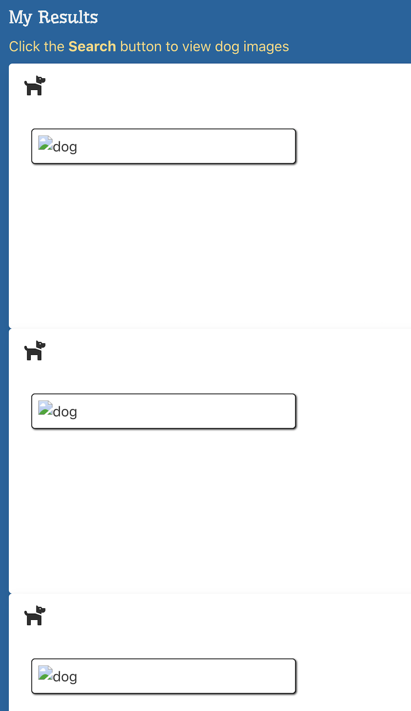
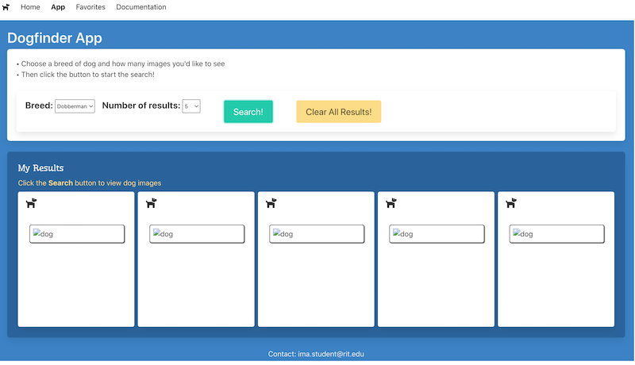
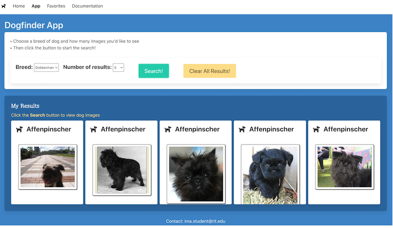

# Dogfinder App - Part III

- Overview: Let's improve the app page by creating "cards" for our results, and improving the styling


## I. Improve the `XHR` Error handling

- Problem: If the dog API server is down, or the user's browser is offline, the `xhr.onerror` handler will fire:
  - right now, that error handler is updating the UI with a message, but it's not turning off the button "spinner" 
  - to see this issue in action, change the beginning of the `baseURL` constant (in **app.js**) from `https` to `htt` - then do a search. Check the console to see the error message, and also note that the button spinner never turns off.
  - let's fix that!
  - Head to **ajax.js** and make the `xhr.onerror` handler look like this:
  
  <hr>
  
  ```js
  xhr.onerror = (evt) => {
    console.log(`ERROR: ${evt}`);
    callback(evt);
  };
  ``` 
  
  <hr>
  
  - also, head to **app.js**, and at the end of the `showResults()` `catch{}` block, add a `return` statement so that we bail out of the function after catching the error (can't believe I forgot that one)
  - click the button (keeping `baseURL` malformed) and you should now see "There was some kind of error!" on the page, and that the button "spinner" effect has been removed
  - make sure the app still works! Change the beginning of `baseURL` back to `https` and then click the search button - the app should function correctly as before
  
 <hr>
    
## II. Get the "limit" control working

- Most APIs have a `limit` parameter that indicates the maximum number of results you want returned
  - **Fun Fact**: why not name this `max` or `num` or ? Because of existing convention. The word "limit" actually comes from SQL - in this case the `LIMIT` clause - https://www.w3schools.com/mysql/mysql_limit.asp
  - **Another Fun Fact**: most APIs accept the "limit" parameter in the URLs' *query string* like this:
    -  `music-service.php?band=rush&limit=5`
    - but the Dog API we have chosen uses a style called [RESTful](https://www.tutorialspoint.com/restful/restful_introduction.htm) - where the parameters like `term` and `limit` are part of the URL. After doing a search, take a look in the console at the URL we are downloading, note how the `breed` and `limit` are part of the URL, and that there isn't a query string
  - Now let's get to it!
  
1) Make sure that `limitParam` is set to a value of `"1"`
  
 <hr>
    
  ```js
  let limitParam = "1";
  ```
  
 <hr>
    
2) We need to initialize the `onchange` event for the "limit" control. Add the following code to the **app.js** `init()` function:
  
 <hr>
    
  ```js
  fieldLimit.onchange = (evt) => {
    limitParam = evt.target.value;
  };
  ```
  
 <hr>
   
3) Now choose 5 on the limit control and click search - you should get 5 results back.
  
  - BTW - this was so easy to do because the `dogURL()` function handles the updating of the url with the new limit value for us

4) Go ahead and get the `fieldBreed` & `breedParam` code working if you want to, and populate `fieldBreed` with more dog breeds


  <hr>
  
 ## III. Improving the look of our results with some *card* HTML and styles
  
 ### III-A. Refactor the code
   
 - In **app.js**, put this "helper" function right before `showResults()`. Eventually, this fucntion will create a nice looking "card" for each result (dog picture) that was found:

```js
const createResultCards = (array) => {
  const html = array.map(url => `<div></div>`).join("");
  elementCardHolder.innerHTML = `<div class="box">${html}</div>`;
};
```

- Now head to `showResults()` and modify the code in the `if( urlArray && Array.isArray(...` statement to instead call `createResultCards()`

```js
if( urlArray && Array.isArray(urlArray) && urlArray.length > 0 ){
  // DELETE THIS LINE -> const html = json.message.map(url => `<div></div>`).join("");
  // DELETE THIS LINE TOO -> elementCardHolder.innerHTML = `<div class="box">${html}</div>`;
  createResultCards(json.message);
} else {
...
```
 
- Run the app - it should run as before (with our "meh" styles)

### III-B. Improve the HTML/CSS

- Below we'll be uing some Bulma card styles to radically improve the look of our results:
  - https://bulma.io/documentation/components/card/
- Let's get started ... make some changes in `createResultCards()`

1) Comment out the two lines of code

2) Write code that clears the results `<div>`, and then loops through the array of urls and extracts the breed name

```js
elementCardHolder.innerHTML = "";
for(let url of array){
  const arr = url.split("/");
  const breed = arr[arr.length - 2];
  console.log(breed);
  
}
```
 - Test it by searching for 5 dogs, you should see the breed name logged to the console 5 times
   - Recall that most APIs will have a lot more info to parse that this - but this API only gives one piece of info to work with, the url of the image!

3) Now let's create the "card" and its HTML (put this in the `for` loop) - here it is for your copy/paste pleasure:

```js
const resultDiv = document.createElement("div");
resultDiv.className = "card";
resultDiv.style = `height:300px;overflow: auto;`;
resultDiv.innerHTML = `
  <div class="card-header-title is-size-4">
    <i class="fas fa-dog mr-3"></i>
    <span style="text-transform: capitalize" id="title"></span>
  </div>
  <div class="card-content">
    <div class="card-image">
      <figure class="image">
        
      </figure>
    </div>
  </div>`;
elementCardHolder.appendChild(resultDiv);
```

<hr>

- Go ahead and do another search for 5 dogs, you should see 5 "empty" cards (it's a little hard to see the borders of the cards right now):



<hr>

- To improve that layout, let's add a little more CSS, this time in the **app.html** file, right up in the `<style>` tag:

```css
#element-card-holder{
  display: grid;
  grid-template-columns: repeat(auto-fill, minmax(250px,1fr));
  grid-gap: 0.5em;
}
```

<hr>

- Much better!



<hr>

- I imagine you'd like to see the dog image and the title on each card?
- Go ahead and do that - you can see that there's `url` and `breed` variables already initialized for you, and that all of the HTML is already inside of a template string, so all you need to do is to add a couple `${}` to the correct places



<hr>

## IV. Creating a `df-resultcard` web component

- While the above code works fine, it's already cluttered with a lot of inline CSS styles, and if we start adding controls such as a favorites button or a close button, and a bunch of JavaScript that goes with it, the `createResultCards()` method is going to start getting pretty bloated
- So let's instead move this "card" code over to a web component!

1) Create **src/df-resultcard.js** and import it at the top of **app.js** - `import "./df-resultcard.js";`

2) In **app.js**, comment out all of the for loop code in our `createResultCards()` method, except for the first two lines that take care of initializing `breed` for us

3) In **df-resultcard.js**, stub in a skeleton of the web component code


<hr><hr>

[**Previous Chapter <- Dogfinder App (part 2)**](dogfinder-2.md)
