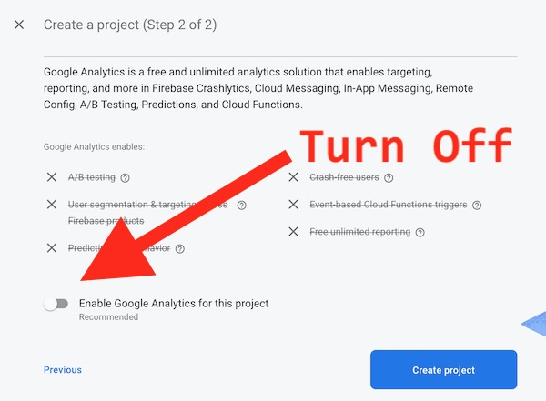
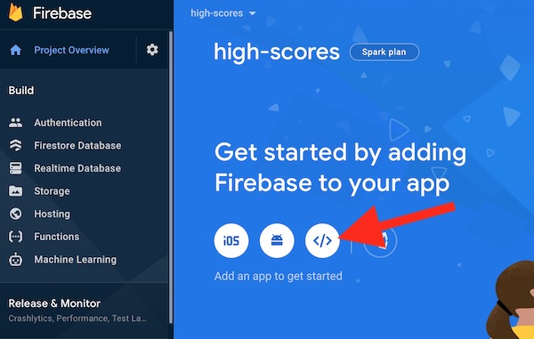
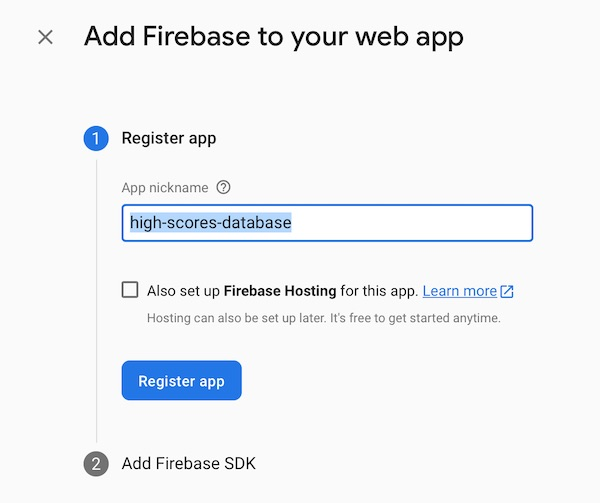
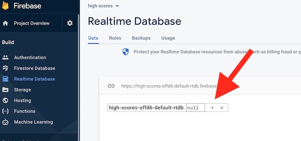
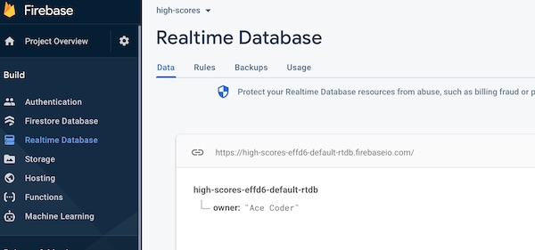
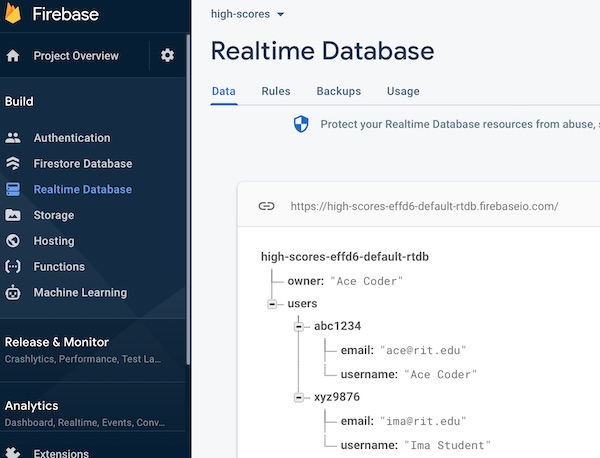

# 1 - Intro to Firebase - the Realtime Database

## I. Overview
- Here we will look at setting up a Firebase *Realtime Database*
  - The Firebase Realtime Database is a cloud-hosted database
  - Data is stored as JSON and synchronized in realtime to every connected client
  - Firebase apps remain responsive even when offline because the Firebase Realtime Database SDK persists your data to disk

<hr><hr>

## II. Setting up a *Realtime Database*

### II-A. Create a new project
- \*\****NOTE: If you run into trouble when you try to set up the Realtime Database (below) with an RIT Gmail account, you may have to instead use your personal Google Account***\*\*
- Head to https://console.firebase.google.com/ 
  - click the **Create Project** or **Add Project** button
  - this will create a pop-up window where you will name your project


<hr>

### II-B. Name the project

- Name the project **high-scores** and click the **Continue** button


<hr>

<!--
### II-C. Add a *Firebase for Web* App to your project

- You should now be on the **Project Overview** screen
- Click on the *Firebase for Web* button on the right, which creates a pop-up window
- This creates a new web app for this project. Note that there are other options for creating Android and iOS Apps. The idea here is that the project will have one set of data, and you could have multiple apps (web, Android, iOS) that SHARE this data



-->

### II-C. Turn Off Google Analytics and Create the Project

- Uncheck **Enable Google Analytics**
- Click the **Create Project** button


<hr>

- On the next screen, after your **high-scores** project has been created, click the **Continue** Button

<hr>

### II-D. Add a *Web App* to your project

- On the Project Overview Screen, click the **Web** button



<hr>

### II-E. Add Firebase to your web app

- Give the app the nickname of **high-scores-database**
- Do NOT check the checkbox to set up Firebase Hosting
- Click the **Register App** button



<hr>


### II-F. Copy the code snippet

- Under Add **Firebase SDK** step:
  - choose the **Use a `<script>` tag** radio button
  - go ahead and create an empty HTML file named **firebase-test.html**
  - copy/paste the Firebase JS code into the document, at the bottom of the `<body>` tag
  - when you are done, click the **Continue to console** button at the bottom of the page
  - **Note:** If you need to get this setup code at a later time, go to **Develop > Authentication** in the [Firebase console](https://console.firebase.google.com), select the project, then click **Web Setup**


**firebase-test.html**
```html
<!doctype html>
<html lang="en">
<head>
  <meta charset="utf-8">
  <meta name="viewport" content="width=device-width, initial-scale=1">
  <title>Firebase Test</title>
</head>
<body>
</body>
</html>
```

<hr>

### II-G. Create a Realtime Database

- Now you should be on the **Project Overview Screen**
- Go ahead and click on the **Realtime Database** button on the left side of the screen 


<hr>

- On the Realtime Database screen, go ahead and click the **Create Database** button

<hr>


### II-H. Choose location and Security rules

- Choose you location (probably the default) and click the **Next** button


<hr>

- On the next screen, choose the **Start in test mode** radio button
- Click the **Enable** button


<hr>

### II-I. Verify

- You should now have created an empty *Realtime Database*
- Move the mouse over to where the arrow is until you see the **+** button appear



<hr>

### II-J. Add a little bit of data to your Realtime Database

- All Firebase Realtime Database data is stored as JSON objects, and you can think of the database as a cloud-hosted JSON tree
- Unlike a SQL database, there are no tables or records
- When you add data to the JSON tree, it becomes a node in the existing JSON structure with an associated key
- You can provide your own keys, such as user IDs or semantic names, or they can be provided for you using `push()`
- The Firebase Realtime Database allows nesting data up to 32 levels deep, but you should avoid nesting data for performance reasons - e.g. when you fetch data at a location in your database, you also retrieve all of its child nodes

<hr>

- Click the **+** button
- Go ahead and add an `owner` **Name** with a **Value** of your name (or nickname)


<hr>

- Then click the **Add** button
- Congrats! You'e created your Firebase Realtime Database (finally) and added some data to it!



<hr><hr>

## III. Do some coding

### III-A. Getting ready
- First, open **firebase-test.html** and add this line of code to the end of the `<script>` tag - `console.log(app);`
- Open the page in a browser and check the console - you should see a log

<hr>

### III-B. `import` the Firebase Realtime Database library

- Add the following code, right after the `initializeApp` ES6 `import`

```js
import { getDatabase, ref, set, onValue } from  "https://www.gstatic.com/firebasejs/9.1.3/firebase-database.js";
```

- This line of code imports 4 functions from Firebase Realtime Database library so that we can use them
- We will only be using the first 3 symbols for this part: `getDatabase`, `ref` and  `set`

<hr>

### III-C. Create a helper function and call it

- Add the following code to the bottom of the `<script>` tag

```js
function writeUserData(userId, name, email) {
  const db = getDatabase();
  set(ref(db, 'users/' + userId), {
			username: name,
			email: email
	});
}

writeUserData("abc1234","Ace Coder","ace@rit.edu");
writeUserData("xyz9876","Ima Student","ima@rit.edu");
```

<hr>

### III-D. Test it

- Reload the browser, you should not see any errors in the console, has anything happened?
- Go check your Realtime Database - you should see something like this - which means that you have successfully pushed data to the "cloud"!



<hr>

### III-E. What does this code do?

- `getDatabase`
- `ref`
- `set`


<hr>

<hr><hr><hr><hr><hr><hr>
### II-H. Test your Realtime Database
- We need to write code in **firebase-test.html** to write some values to your database
- To test your database, add the following to the &lt;script> tag, right after the code that you previously copy/pasted:

```js
  console.log(firebase); // verify that firebase is loaded by logging the global it created for us
  
  // #1 - get a reference to the databse
  let database = firebase.database();
  
  // #2 - refer to a root node named `scores`
  let ref = database.ref('scores');
 
 // #3 - create some data
  let data = {
  	name: "MADMAX",
    realName: "Maxine Mayfield",
    gameName: "Dig Dug",
  	score: 750200
  };
  
  // #4 - send data, in this case we are adding it to the `scores` node
  ref.push(data);
```

<hr>

- reload the page
- If you get the error "firebase.database is not a function", add these additional libraries after the firebase-app.js library.  You should change the version numbers to be the same as the version number for firebase-app.js.

```js
<script src="https://www.gstatic.com/firebasejs/7.4.0/firebase-auth.js"></script>
<script src="https://www.gstatic.com/firebasejs/7.4.0/firebase-database.js"></script>
```

- the above URL's came from this page: https://firebase.google.com/docs/web/setup#available-libraries

### II-I. See the changes!

- Head back to your high-scores database, you should see the high score has been posted to "the cloud" - oooh!
- If you reload your HTML page, the data will be posted multiple times, each time with a unique key (UUID)


<hr>

### II-J. Add a little bit of data to the Realtime Database

- All Firebase Realtime Database data is stored as JSON objects, and you can think of the database as a cloud-hosted JSON tree
- Unlike a SQL database, there are no tables or records
- When you add data to the JSON tree, it becomes a node in the existing JSON structure with an associated key
- You can provide your own keys, such as user IDs or semantic names, or they can be provided for you using `push()`
- The Firebase Realtime Database allows nesting data up to 32 levels deep, but you should avoid nesting data for performance reasons - e.g. when you fetch data at a location in your database, you also retrieve all of its child nodes

<hr>

## III. Review Exercise

- Go ahead and add a new node to the JSON tree named `users`
- Then add 2 users to this node - users need to have values for 3 properties: `id`, `firstName`, and `lastName`
- Now modify the `scores` node so that the score JSON objects have 2 properties: `id` and `score`
- To see how you can get a autogenerated key from `.push()`, change line #4 to this:

```js
let newScoreRef = ref.push(data);
console.log(newScoreRef.key); // the autogenerated `key` we get back from Firebase
console.log(newScoreRef.toString()); // the full path to that data on Firebase
```

## IV. Documentation and Examples

- Firebase Realtime Database --> https://firebase.google.com/docs/database/
- Methods: 
    - Initialize Firebase application --> [`firebase.initializeApp(config)`](https://firebase.google.com/docs/reference/js/firebase#.initializeApp)
    - Get reference to JSON path --> [`firebase.database.ref()`](https://firebase.google.com/docs/reference/js/firebase.database.Database?authuser=0#ref)
    - Push JSON object onto path --> [`firebase.database.ref.push()`](https://firebase.google.com/docs/reference/js/firebase.database.Reference?authuser=0#push)
- Get Started with Firebase for Web Apps --> https://firebase.google.com/docs/web/setup?authuser=0
- Firebase Web SDK API Reference --> https://firebase.google.com/docs/reference/js/index-all?authuser=0
- Firebase Web Samples --> https://firebase.google.com/docs/samples/?authuser=0#web

<hr><hr>

**[Next Chapter -> Firebase Part II - High Score App](firebase-2.md)**
