# 1 - Intro to Firebase - the Realtime Database

## I. Overview
- Here we will look at setting up a Firebase *Realtime Database*
  - The Firebase Realtime Database is a cloud-hosted database
  - Data is stored as JSON and synchronized in realtime to every connected client
  - Firebase apps remain responsive even when offline because the Firebase Realtime Database SDK persists your data to disk

<hr><hr>

## II. Setting up a *Realtime Database*

### II-A. Create a new project
- \*\****NOTE: If you run into trouble when you try to set up the Realtime Database (below) with an RIT Gmail account, you may have to instead use your personal Google Account***\*\*
- Head to https://console.firebase.google.com/ 
  - click the **Create Project** or **Add Project** button
  - this will create a pop-up window where you will name your project

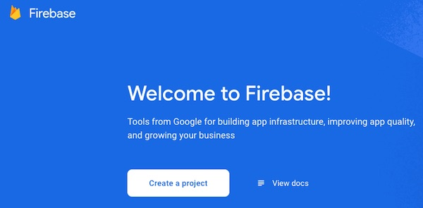

<hr>

### II-B. Name the project

- Name the project **high-scores** and click the **Continue** button


<hr>

### II-C. Turn Off Google Analytics and Create the Project

- Uncheck **Enable Google Analytics**
- Click the **Create Project** button

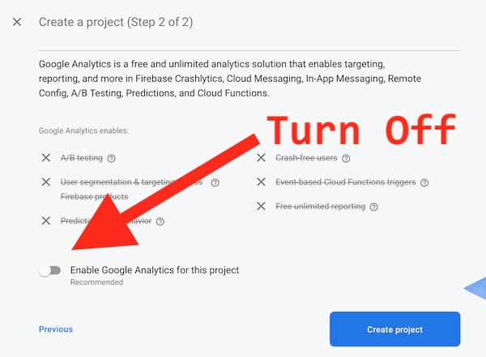

<hr>

- On the next screen, after your **high-scores** project has been created, click the **Continue** Button

<hr>

### II-D. Add a *Web App* to your project

- On the Project Overview Screen, click the **Web** button

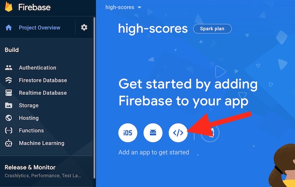

<hr>

### II-E. Add Firebase to your web app

- Give the app the nickname of **high-scores-database**
- Do NOT check the checkbox to set up Firebase Hosting
- Click the **Register App** button

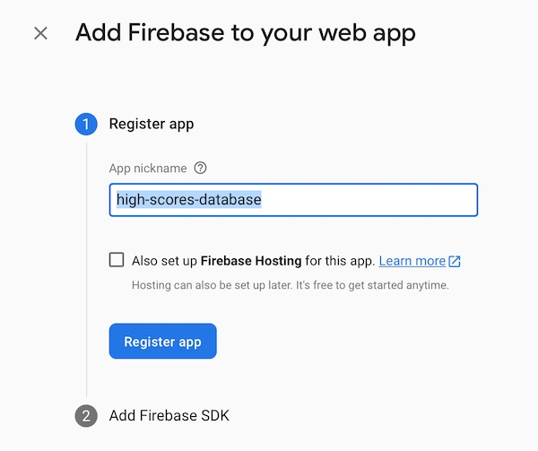

<hr>


### II-F. Copy the code snippet

- Under Add **Firebase SDK** step:
  - choose the **Use a `<script>` tag** radio button
  - go ahead and create an empty HTML file named **firebase-test.html**
  - copy/paste the Firebase JS code into the document, at the bottom of the `<body>` tag
  - when you are done, click the **Continue to console** button at the bottom of the page
  - **Note:** If you need to get this setup code at a later time, go to **Develop > Authentication** in the [Firebase console](https://console.firebase.google.com), select the project, then click **Web Setup**

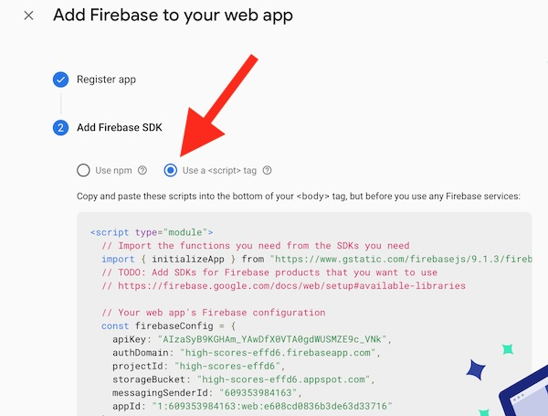

**firebase-test.html**
```html
<!doctype html>
<html lang="en">
<head>
  <meta charset="utf-8">
  <meta name="viewport" content="width=device-width, initial-scale=1">
  <title>Firebase Test</title>
</head>
<body>
</body>
</html>
```

<hr>

### II-G. Create a Realtime Database

- Now you should be on the **Project Overview Screen**
- Go ahead and click on the **Realtime Database** button on the left side of the screen 

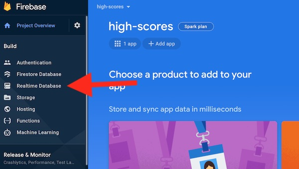

<hr>

- On the Realtime Database screen, go ahead and click the **Create Database** button

<hr>


### II-H. Choose location and Security rules

- Choose you location (probably the default) and click the **Next** button

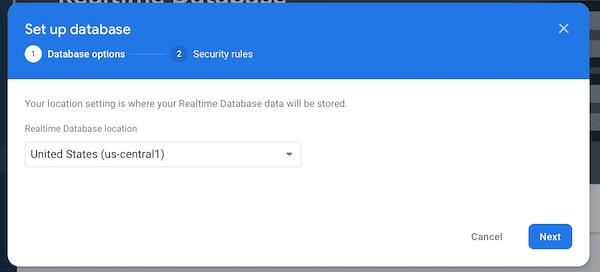

<hr>

- On the next screen, choose the **Start in test mode** radio button
- Click the **Enable** button

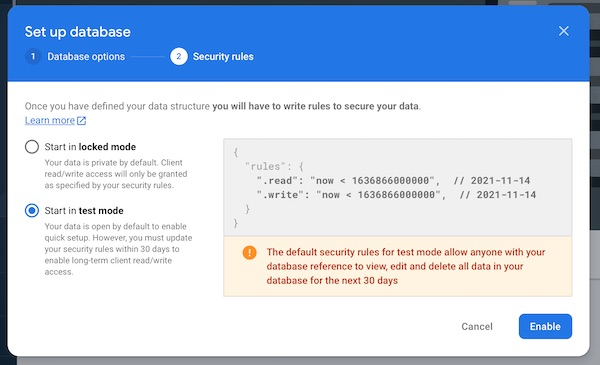

<hr>

### II-I. Verify

- You should now have created an empty *Realtime Database*
- Move the mouse over to where the arrow is until you see the **+** button appear

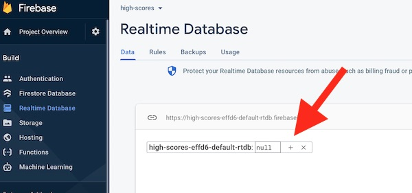

<hr>

### II-J. Add a little bit of data to your Realtime Database

- All Firebase Realtime Database data is stored as JSON objects, and you can think of the database as a cloud-hosted JSON tree
- Unlike a SQL database, there are no tables or records
- When you add data to the JSON tree, it becomes a node in the existing JSON structure with an associated key
- You can provide your own keys, such as user IDs or semantic names, or they can be provided for you using `push()`
- The Firebase Realtime Database allows nesting data up to 32 levels deep, but you should avoid nesting data for performance reasons - e.g. when you fetch data at a location in your database, you also retrieve all of its child nodes

<hr>

- Click the **+** button
- Go ahead and add an `owner` **Name** with a **Value** of your name (or nickname)

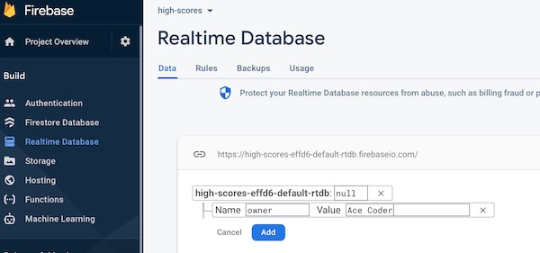

<hr>

- Then click the **Add** button
- Congrats! You'e created your Firebase Realtime Database (finally) and added some data to it!

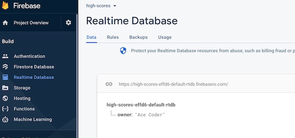

<hr><hr>

## III. Do some coding

- BTW - If you get stuck on anything related to the Realtime Database, the best place to look is in the [Firebase Realtime Database - Installation & Setup in JavaScript](https://firebase.google.com/docs/database/web/start) page

### III-A. Getting ready
- First, open **firebase-test.html** and add this line of code to the end of the `<script>` tag - `console.log(app);`
- Open the page in a browser and check the console - you should see a log

<hr>

### III-B. `import` the Firebase Realtime Database library

- Add the following code, right after the `initializeApp` ES6 `import`

```js
import { getDatabase, ref, set, push, onValue } from  "https://www.gstatic.com/firebasejs/9.1.3/firebase-database.js";
```

- This line of code imports 5 functions from Firebase Realtime Database library so that we can use them
- We will only be using the first 3 symbols for this part: `getDatabase`, `ref` and `set`

<hr>

### III-C. Create a helper function and call it

- Add the following code to the bottom of the `<script>` tag

```js
function writeUserData(userId, name, email) {
  const db = getDatabase();
  set(ref(db, 'users/' + userId), {
    username: name,
    email: email
  });
}

writeUserData("abc1234","Ace Coder","ace@rit.edu");
writeUserData("xyz9876","Ima Student","ima@rit.edu");
```

<hr>

### III-D. Test `writeUserData()` and `set()`

- Reload the browser, you should not see any errors in the console, has anything happened?
- Go check your Realtime Database - you should see something like this - which means that you have successfully put data into the "cloud"!

<hr>

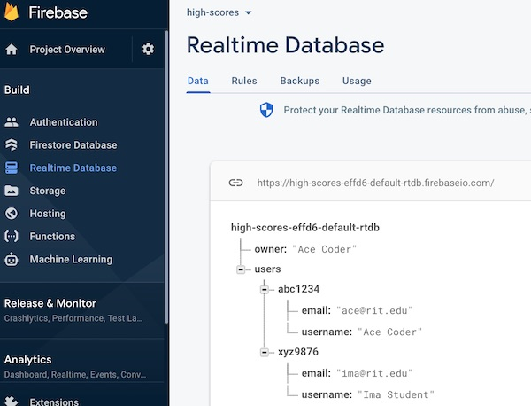

<hr>

- When writing to the database using `set()` -  each username is a unique key on `users/` - and can be overwritten
- Add this line of code to the end of the `<script>` tag and see what happens:
  - `writeUserData("xyz9876","Ima Graduate","ima@realworld.com");`
  - Check the Firebase control panel - you should see that the `xyz9876` values have updated! 

<hr>

### III-E. How does the above code work?
- Firebase Documentation --> https://firebase.google.com/docs/reference/js/
- Firebase Realtime Database Documentation --> https://firebase.google.com/docs/reference/js/database.md
- Go read about these functions now:
  - `initializeApp()` --> https://firebase.google.com/docs/reference/js/app.md#initializeapp
  - `getDatabase()` --> https://firebase.google.com/docs/reference/js/database.md#getdatabase
  - `ref()` --> https://firebase.google.com/docs/reference/js/database.md#ref
  - `set()` --> https://firebase.google.com/docs/reference/js/database.md#set

<hr>

### III-F. Last thing, let's `push()` some high scores to the cloud

- Here is our helper function and some code that calls it
- Add this to the bottom of the `<script>` tag

```js
function writeHighScoreData(userId, game, score) {
  const db = getDatabase();
  const scoresRef = ref(db, 'scores');
  const newScoreRef = push(scoresRef,{
    userId,
    game,
    score
  });
  // the unique ID generated by Firebase that we could use later to reference or change this value
  console.log("newScoreRef",newScoreRef.key);
}

writeHighScoreData("abc1234","Breakout",100);
writeHighScoreData("xyz9876","Tetris",1000);
```

- Reload the page (once) and head to the Firebase control panel:
  - you should see that our high score data has been pushed to the cloud
  - you should also see that each high score has a unique identifier, generated by Firebase, which means we can't over-write old scores
  - which means that when you use `push()`, you are create a *list* (basically an array) of items in the cloud

<hr>

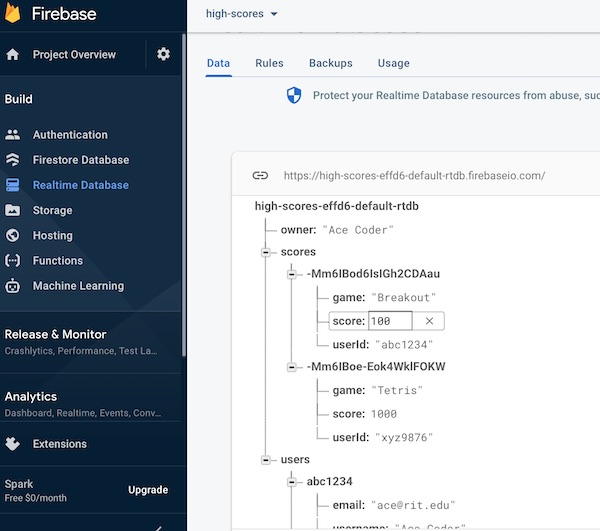

<hr>

- Now reload the page a few times, check the Firebase control panel, and you will see the *downside* of `push()`
- `push` --> https://firebase.google.com/docs/reference/js/database.md#push
- Append to a list of data --> https://firebase.google.com/docs/database/web/lists-of-data#append_to_a_list_of_data

<a id="documentation" />

<hr>

## IV. Documentation
- Get Started with Firebase for Web Apps --> https://firebase.google.com/docs/database/web/start
- Firebase Realtime Database Overview --> https://firebase.google.com/docs/database/
- Realtime Database - Get Started --> https://firebase.google.com/docs/database/web/start
- Realtime Database - Structure Data --> https://firebase.google.com/docs/database/web/structure-data
- Realtime Database - Read/Write/Update/Delete --> https://firebase.google.com/docs/database/web/read-and-write
- Realtime Database - Work with Lists of Data on the Web --> https://firebase.google.com/docs/database/web/lists-of-data
- Realtime Database - Enable Offline Capabilities --> https://firebase.google.com/docs/database/web/offline-capabilities
- Firebase Web Samples --> https://firebase.google.com/docs/samples/
- Firebase API Web Reference --> https://firebase.google.com/docs/reference/js/
- Functions: 
  - `initializeApp()`
    - *Creates and initializes a FirebaseApp instance*
    - https://firebase.google.com/docs/reference/js/app.md#initializeapp
  - `getDatabase()`
    - *Returns the instance of the Realtime Database SDK that is associated with the provided FirebaseApp*
    - https://firebase.google.com/docs/reference/js/database.md#getdatabase
  - `ref()`
     - *Returns a Reference representing the location in the Database corresponding to the provided path. If no path is provided, the Reference will point to the root of the Database*
     - https://firebase.google.com/docs/reference/js/database.md#ref
  - `set()`
    - *writes data to a database location*
    - https://firebase.google.com/docs/reference/js/database.md#set
  - `push()`
    - *Generates a new child location using a unique key and returns its Reference. This is the most common pattern for adding data to a collection of items. If you provide a value to push(), the value is written to the generated location.*
    - https://firebase.google.com/docs/reference/js/database.md#push

<hr>

## V. Deliverables?
- None!
- Just get this working and move on!

<hr><hr>

**[Next Chapter -> Firebase Part II - High Score App](firebase-2.md)**
