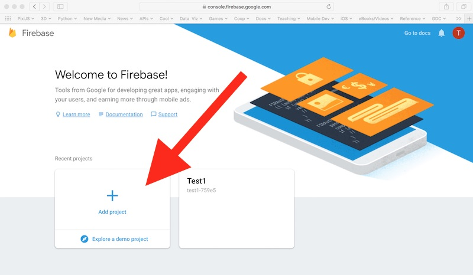
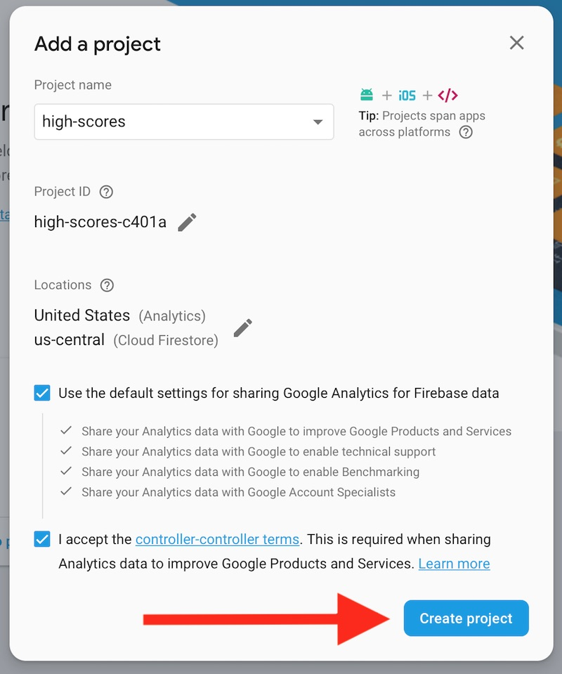
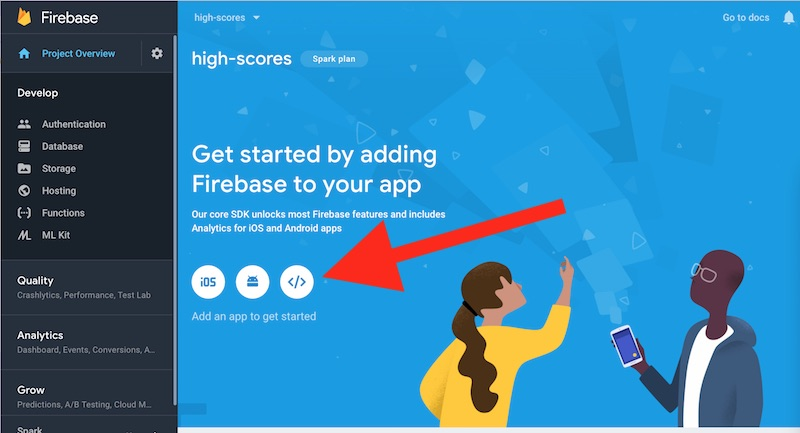
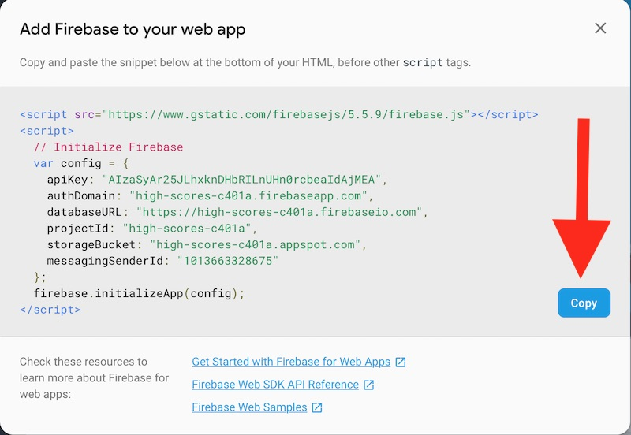
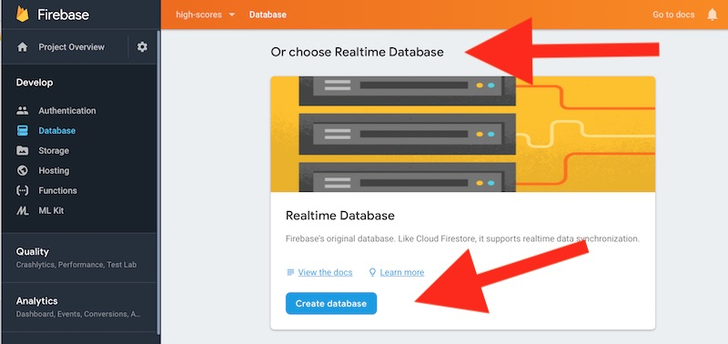
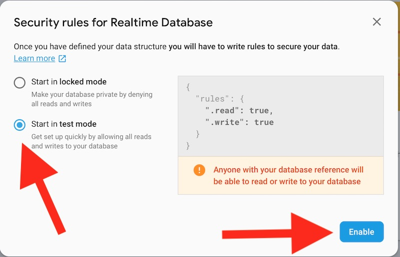
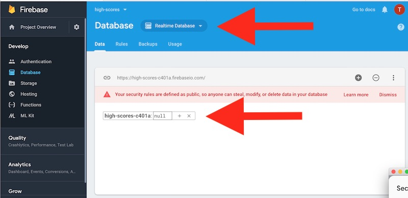
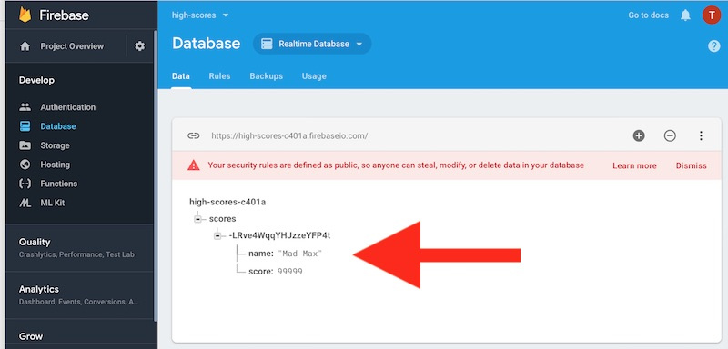

# 1 - Intro to Firebase - the Realtime Database

## I. Overview
- Here we will look at setting up a Firebase *Realtime Database*
  - The Firebase Realtime Database is a cloud-hosted database
  - Data is stored as JSON and synchronized in realtime to every connected client
  - Firebase apps remain responsive even when offline because the Firebase Realtime Database SDK persists your data to disk

## II. Setting up a *Realtime Database*

### II-A. Create a new project

- Head to https://console.firebase.google.com/ and click the *Add Project* button, this will create a pop-up window where you will name your project



<hr>

### II-B. Name the project

- Name the project **high-scores** and click the **Create Project** button



<hr>

### II-C. Add a *Firebase for Web* App to your project

- You should now be on the **Project Overview** screen
- Click on the *Firebase for Web* button on the right, which creates a pop-up window
- This creates a new web app for this project. Note that there are other options for creating Android and iOS Apps. The idea here is that the project will have one set of data, and you could have multiple apps (web, Android, iOS) that SHARE this data



<hr>

### II-D. Copy the code snippet

- A pop-up window will appear that contains the JavaScript set-up code you will need to enable Firebase on a web page
- Go ahead and create an HTML file named **firebase-test.html** and copy/paste this JS code into the &lt;head> section of the document
- **Note:** If you need to get this setup code at a later time, go to **Develop > Authentication** in the [Firebase console](https://console.firebase.google.com), select the project, then click **Web Setup**



<hr>

### II-E. Create a Realtime Database

- After you have copied the code, close the pop-up window
- To change to the *Database* screen, click on the **Database** tab on the left 
- Then scroll down the page, and stop at the **Or choose Realtime Database** heading
- Click the **Create Database** button, which will open a pop-up window



<hr>

### II-F. Set the security rules for your database

- Choose **Start in test mode**
- Click the **Enable** Button
- You can modify these rules later under the "Rules" tab



<hr>

### II-G. Verify

- You should now have created an empty *Realtime Database*



<hr>

### II-H. Test your Realtime Database
- We need to write code in **firebase-test.html** to write some values to your database
- To test your database, add the following to the &lt;script> tag, right after the code that you previously copy/pasted:

```js
  console.log(firebase); // verify that firebase is loaded by logging the global it created for us
  
  // #1 - get a reference to the databse
  let database = firebase.database();
  
  // #2 - refer to a root node named `scores`
  let ref = database.ref('scores');
 
 // #3 - create some data
  let data = {
  	name: "MADMAX",
    realName: "Maxine Mayfield",
    gameName: "Dig Dug",
  	score: 750200
  };
  
  // #4 - send data, in this case we are adding it to the `scores` node
  ref.push(data);
```

<hr>

- reload the page
- If you get the error "firebase.database is not a function", add these additional libraries after the firebase-app.js library.  You should change the version numbers to be the same as the version number for firebase-app.js.

```js
<script src="https://www.gstatic.com/firebasejs/7.4.0/firebase-auth.js"></script>
<script src="https://www.gstatic.com/firebasejs/7.4.0/firebase-database.js"></script>
```

- the above URL's came from this page: https://firebase.google.com/docs/web/setup#available-libraries

### II-I. See the changes!

- Head back to your high-scores database, you should see the high score has been posted to "the cloud" - oooh!
- If you reload your HTML page, the data will be posted multiple times, each time with a unique key (UUID)



<hr>

### II-J. Discussion

- All Firebase Realtime Database data is stored as JSON objects, and you can think of the database as a cloud-hosted JSON tree
- Unlike a SQL database, there are no tables or records
- When you add data to the JSON tree, it becomes a node in the existing JSON structure with an associated key
- You can provide your own keys, such as user IDs or semantic names, or they can be provided for you using `push()`
- The Firebase Realtime Database allows nesting data up to 32 levels deep, but you should avoid nesting data for performance reasons - e.g. when you fetch data at a location in your database, you also retrieve all of its child nodes

<hr>

## III. Review Exercise

- Go ahead and add a new node to the JSON tree named `users`
- Then add 2 users to this node - users need to have values for 3 properties: `id`, `firstName`, and `lastName`
- Now modify the `scores` node so that the score JSON objects have 2 properties: `id` and `score`
- To see how you can get a autogenerated key from `.push()`, change line #4 to this:

```js
let newScoreRef = ref.push(data);
console.log(newScoreRef.key); // the autogenerated `key` we get back from Firebase
console.log(newScoreRef.toString()); // the full path to that data on Firebase
```

## IV. Documentation and Examples

- Firebase Realtime Database --> https://firebase.google.com/docs/database/
- Methods: 
    - Initialize Firebase application --> [`firebase.initializeApp(config)`](https://firebase.google.com/docs/reference/js/firebase#.initializeApp)
    - Get reference to JSON path --> [`firebase.database.ref()`](https://firebase.google.com/docs/reference/js/firebase.database.Database?authuser=0#ref)
    - Push JSON object onto path --> [`firebase.database.ref.push()`](https://firebase.google.com/docs/reference/js/firebase.database.Reference?authuser=0#push)
- Get Started with Firebase for Web Apps --> https://firebase.google.com/docs/web/setup?authuser=0
- Firebase Web SDK API Reference --> https://firebase.google.com/docs/reference/js/index-all?authuser=0
- Firebase Web Samples --> https://firebase.google.com/docs/samples/?authuser=0#web

<hr><hr>

**[Next Chapter -> Firebase Part II - High Score App](firebase-2.md)**
