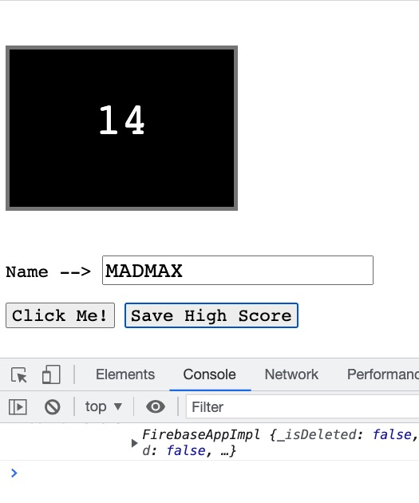
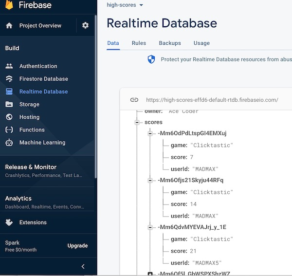
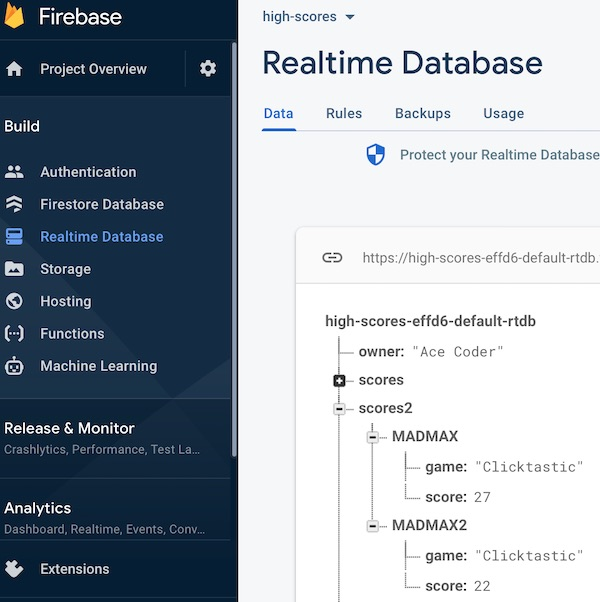

# 2 - Firebase Highscore App

## I. Overview

- Here we will look at two distinct ways to post high scores and user names to Firebase's Realtime Database!

<hr>

## II. Start code

- The code below will create the interface for this "clicking" game
- Be sure to add your firebase setup code below
- Test the app, you should see something like the screenshot below:
  - The "Click Me!" button will work
  - You should see the firebase object logged to the console

**firebase-high-score.html**

```html
<!doctype html>
<html lang="en">
<head>
	<meta charset="utf-8" />
	<title>High Score App</title>
	<style>
	*{
		font-family: monospace;
		font-size:1.2em;
	}
	#scoreElement{
		font-size:3em;
		width:5em;
		height:2.5em;
		color:white;
		background-color:black;
		border:5px solid gray;
		text-align:center;
		padding-top: 1em;
	}
	</style>
</head>
<body>


<p id="scoreElement">0</p>
<p>Name --> <input type="text" value="MADMAX" id="nameField"></p>
<button id="clickMeButton">Click Me!</button>
<button id="saveScoreButton">Save High Score</button>

<script type="module">

/* The Firebase setup code goes here  - both imports, `firebaseConfig` and `app` */
	
console.log(firebase); // make sure firebase is loaded
	
	
/* Also bring over your `writeHighScoreData()` helper function */
	
let score = 0;
	
clickMeButton.onclick = _ => {
  score++;
  scoreElement.innerText = score;
};
	

</script>

</body>
</html>
```

**Screenshot:**



<hr>

## III. Save the values to Firebase using `.push()`

- This is very similar to how we did this last time
- We will get a reference to a `scores` node, and "push" JSON objects onto it, effectively creating a list
- The JSON objects will contain the currrent score, and the current typed in user name
- Go ahead and add this click handler for the "Save High Score" button:


```js
saveScoreButton.onclick = _ => {
  writeHighScoreData(nameField.value,"Clicktastic",score);
};
```
- Test the app by running up the score, and then clicking the "Save High Score" button
- You should now see these changes in the firebase console, where each score object has a *key* that is auto-generated by firebase :



<hr>

## IV. Save the values to Firebase using `.set()`

- This time we will use the `.set()` method to add objects to firebase, and will provide our own *key*
- This means that if we re-use the key, we can overwrite a previous JSON object
- Here it means that there will be only one high score per username

### IV-A. Instructions

- Here is a new `writeHighScoreData2()` helper function that uses `set()`:
- Call it instead of `writeHighScoreData()` 

```js
function writeHighScoreData2(userId, game, score) {
  const db = getDatabase();
  set(ref(db, 'scores2/' + userId), {
    game,
    score
  });
}
```

- Note that we are saving everything under a new JSON node named `scores2`
- Test it by submitting multiple scores under the same username, and then head to the firebase console, you should only see the last score submitted:



- Note that the auto-generated key is gone, replaced by the user name
- Hint: It would probably be better if you generated a GUID as a key, and then saved it in local storage. Then the user's name would not potentially collide with other users that have the same name:
  - https://stackoverflow.com/questions/105034/create-guid-uuid-in-javascript
  
  <hr>
  
## V. Documentation

- Overwrite JSON object at path by using `.set()` --> https://firebase.google.com/docs/reference/js/firebase.database.Reference?authuser=0#set

<hr>

## VI. Deliverables?
- None!
- Just get this working and move on!

<hr><hr>

**[Previous Chapter <- Firebase Part I - Intro](firebase-1.md)**

**[Next Chapter -> Firebase Part III - High Score Viewer](firebase-3.md)**
