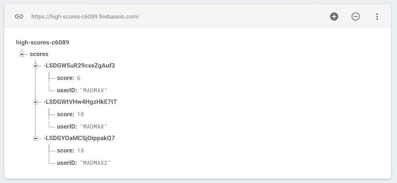

# 2 - Firebase Highscore App

## I. Overview

- Here we will see how to post high scores to Firebase

## II. Start code

- The code below will create the interface for this "clicking" game
- Be sure to add your firebase setup code in #1 and #2 below
- Test the app, you should see something like the screenshot below:
  - The "Click Me!" button will work
  - You should see the firebase object logged to the console

**firebase-high-score.html**

```html
<!DOCTYPE html>
<html lang="en">
<head>
	<meta charset="utf-8" />
	<title>High Score App</title>
	<style>
	*{
		font-family: monospace;
		font-size:1.2em;
	}
	#scoreElement{
		font-size:3em;
		width:5em;
		height:2.5em;
		color:white;
		background-color:black;
		border:5px solid gray;
		text-align:center;
		padding-top: 1em;
	}
	</style>
</head>
<body>


<p id="scoreElement">0</p>
<p>Name --> <input type="text" value="MADMAX" id="nameField"></p>
<button id="clickMeButton">Click Me!</button>
<button id="saveScoreButton">Save High Score</button>

<!-- #1 - link to Firebase goes here  -->


<script type="module">

/* #2 - The rest of the Firebase setup code goes here */
	
console.log(firebase); // #3 - make sure firebase is loaded
	
let score = 0;
	
clickMeButton.onclick = _ => {
	score++;
	scoreElement.innerText = score;
};
	

</script>

</body>
</html>
```


## III. Save the values to Firebase

- This is very similar to how we did this in the previous section  
- We will get a reference to a `scores` node, and push JSON objects onto it
- The JSON objects will contain the currrent score, and the current typed in user name
- Go ahead and add this click handler for the "Save High Score" button:


```js
saveScoreButton.onclick = _ => {
	firebase.database().ref('scores').push({
		userID: nameField.value,
		score: score
	});
};
```
- Test it by running up the score, and then clicking the "Save High Score" button
- You should now see these changes in the firebase console:



<hr><hr>

**[Previous Chapter <- Firebase Part I - Intro](firebase-1.md)**

**[Next Chapter -> Firebase Part III - High Score Viewer](firebase-3.md)**
