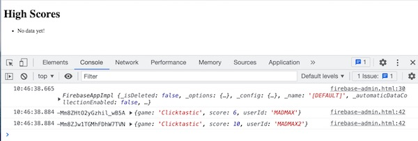
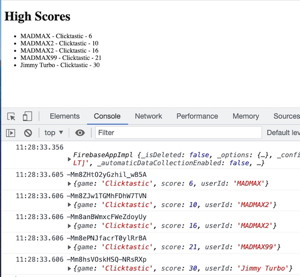

# 3 - Firebase Highscore Viewer

## I. Overview

- Here we going to create an "admin page" that will subscribe to score updates from Firebase's Realtime Database!
- Get ready:
  - Make sure that you have some user score data under `scores/` in Firebase - check the Firebase control panel
  - Head back to **firebase-high-score.html** from last time and change the `onclick` code to call `writeHighScoreData()` (instead of `writeHighScoreData2()`)
  - Test it by adding new user scores with **firebase-high-score.html**, then check the Firebase control panel to verify that this new data is being added to `scores/` 

<hr>

## II. Start code

- The code below will create the interface for this "admin" page
- Be sure to add your firebase setup code to #1 below
- Test the app, you should see something like the screenshot below:
  - There won't be anything in our unordered list other than the "No data yet!" text
  - You should see the firebase object logged to the console (the first log)
  - You should also see your `scores` data has been pulled down from firebase and logged to the console (the second log) 
  - Now open up **firebase-high-score.html** and save some new high score data - both to existing users and new users - you should see the `console.log()` fire again and display the new data 

**firebase-admin.html**

```html
<!doctype html>
<html lang="en">
<head>
	<meta charset="utf-8" />
	<title>Firebase Admin</title>
</head>
<body>
<h1>High Scores</h1>
<ul id="scoresList"><li>No data yet!</li></ul>

<script type="module">
 /* #1 - The Firebase setup code goes here  - both imports, `firebaseConfig` and `app` */

  console.log(app); // make sure firebase is loaded
	
	
	
  // #2 NEW STUFF
  const db = getDatabase();
  const scoresRef = ref(db, 'scores');

  const scoresChanged = (snapshot) => {
    snapshot.forEach(score => {
      const childKey = score.key;
      const childData = score.val();
      console.log(childKey,childData);
    });
  }

  onValue(scoresRef,scoresChanged);
	
</script>
</body>
</html>
```

**Screenshot:**
	


<hr>

## III. Discussion

- This code - `onValue(scoresRef,scoresChanged, {onlyOnce: false});` - listens for when any of the values in the `scores` list changes - and then it executes a *callback function* named `scoresChanged`
- `scoresChanged` then loops through the contents of the `scores` list (which are stored in `snapshot)` and logs out the unique key and value of each player score
- The value of each player score in an object literal that contains the `userId`, `game` and `score` values we have previously sent to Firebase
- This is useful when you want to fetch all children of a list in a single operation
- The callback function will be triggered for the initial data and again whenever the score data changes (that is what `onlyOnce: false` does)

<!--
- Comment #4 above used this line - `firebase.database().ref("scores2").on("value", dataChanged, firebaseError);` - to listen for changes to our firebase database:
  - `firebase.database.ref.on`:
    - is documented here - https://firebase.google.com/docs/reference/js/firebase.database.Reference?authuser=0#on
    - listens for data changes at a particular *location* (i.e. node/reference)
    - is the primary way to read data from a database
    - the callback will be triggered for the initial data and again whenever the data changes
    - use `ref.off()` to stop receiving updates
  - `scores2` in the node we are listening to for changes
  - `dataChanged` is the "success" function that will be called when the data changes
    - note that `data.val()` is an object (not an array) with named keys like `MADMAX`, `MADMAX2` etc, so we won't be able to `for..of` it later on like we do with arrays
  - `firebaseError` is the "error" function that will be called if there is an error (if the app is offline, for example)
-->

<hr>

## IV. Display the score data in the list - YOU DO THIS

- You will display this data to the user by generating HTML list items - `<li>` elements in the `forEach()` loop above
- Hint: `childData` is on object that holds the user score - and it has `userId`, `game` and `score` properties
- Test it by adding new user scores with **firebase-high-score.html** - they should immediately appear in the list 

**When you are done, it should look like this:**



<hr>

<!--
Make **dataChanged()** look like this:

```js
function dataChanged(data){
  let obj = data.val();
  console.log(obj);
  let bigString="";
  for (let key in obj){   // use for..in to interate through object keys
    let row = obj[key];
    bigString += `<li>${row.userID } :  ${row.score}</li>`;
    console.log(row);
  }	
  scoresList.innerHTML = bigString;
}
```

- above, recall that `obj` is an object, not an array, so we instead use a `for..in` loop to iterate through the object keys 
- **You should now see the contents of the `score2` node in the web browser window:**


### IV-B. Loop through the score data a different way

- Alternatively, you could use `Object.keys()` and a `for..of` loop to do the same thing. Replace the `for..in` line above with this:

`for (let key of Object.keys(obj)){ // use for..of to interate through object keys`

<hr>

## V. Listen for changes to only one object

- Sometimes you are only interested in whether or not a single JSON object changed a value. To accomplish this you just have to change the node (`ref`) that your `on` handler is observing:

```js
firebase.database().ref("scores2/MADMAX").on("value", madmaxChanged, firebaseError);

function madmaxChanged(data){
  let obj = data.val();
  console.log(`madmaxChanged = ${obj}`);
  console.log(`userName = ${obj.userID}`);
  console.log(`score= ${obj.score}`);
};
```

- Here we will only get a single "High Score" object back
- When you first load the page, you will see a log like this:

```
madmaxChanged = [object Object]
userName = MADMAX
score= 60
```

- and when you update the MADMAX score either in the firebase console, or in **firebase-high-score.html**, you will see a log like this:

```
madmaxChanged = [object Object]
userName = MADMAX
score= 110
```

<hr>

## VI. Try it yourself

- add an &lt;h1> to the page that updates to display the MADMAX score (only) whenever that score changes
- change our &lt;ul> to an &lt;ol>, and sort the scores from high to low
- Future challenge once you learn some Vue.js: change this app to use Vue.js to update the interface (i.e. get rid of `document.querySelector()` and DOM manipulation)

<hr>

-->

## V. Wrap up
- that's all you need to know about firebase to fulfill the project 2 requirements - but there's a lot more you could do, such as writing some rules to secure your data (i.e. don't let someone hack your JavaScript to overwrite your `scores` nodes): 
  - https://firebase.google.com/docs/database/security/quickstart
  - https://firebase.google.com/docs/database/security/
  - https://medium.com/@dftaiwo/understanding-the-power-of-firebase-security-rules-part-1-f46aae773a24
  - https://stackoverflow.com/questions/37482366/is-it-safe-to-expose-firebase-apikey-to-the-public
  - https://stackoverflow.com/questions/35418143/how-to-restrict-firebase-data-modification
  - https://medium.com/google-cloud/how-secure-is-your-firebase-ec4eb882f34b
  - https://javebratt.com/hide-firebase-api/

<hr>

## VI. Submission

- Get everything working and post both the **firebase-high-score.html** and **firebase-admin.html** files to the web
- See dropbox for submission instructions

<hr>

## VII. N.B. - One last note - how to listen for changes to only one object

- Sometimes you are only interested in whether or not a single JSON object changed a value
- To accomplish this you just have to change the node `ref()` that your `onValue` handler is observing:

```js
const madmaxChanged = (data) => {
    let obj = data.val();
    console.log("scores2/ - madmaxChanged", obj);
    console.log("game = ", obj.game);
    console.log("score = ", obj.score);
  };

const scoresRef2 = ref(db, 'scores2/MADMAX');
onValue(scoresRef2,madmaxChanged);
```
 
- Here we will only get a single "High Score" object back
- When you first load the page, you will see a log like this:

```
scores2/ - madmaxChanged {game: 'Clicktastic', score: 10}
firebase-admin.html:55 game =  Clicktastic
firebase-admin.html:56 score =  10
```
 
<hr><hr>

**[Previous Chapter <- Firebase Part II - Highscore App](firebase-2.md)**
