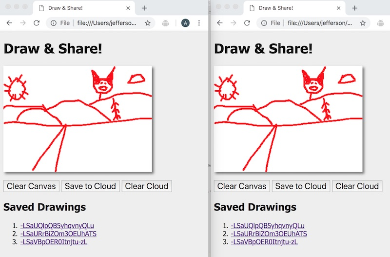

# 4 - Firebase "Draw & Share" App

## I. Overview

- We are going to take a slimmed down version of the [HW-drawing-app.md](./HW-drawing-app.md) we did at the beginning of the semester, and give it the  ability to save to Firebase's Realtime Database!
- This will enable users to share their drawings with others
- Below we have the same drawing data loaded from Firebase, and then drawn into 3 different browser windows:



<hr>

## II. Start code


**draw-and-share-start.html**

```html
<!DOCTYPE html>
<html lang="en">
<head>
	<meta charset="utf-8" />
	<title>Draw & Share!</title>
	 <style>
      body{
         background: #eeeeee;
         font-family: tahoma, verdana, sans serif;
      }

      canvas{
         background: #ffffff;
         box-shadow: 4px 4px 8px rgba(0,0,0,0.5);
      }
      
      #controls{
      	margin-top:1em;
      }
      
      #controls button{
      	font-size:1.25em;
      }
      
      #controls button:hover{
      	background-color:lightgray;
      }
     
    </style>
</head>
<body>
	<h1>Draw & Share!</h1>
	<canvas id="canvas" width="350" height="250"></canvas>
	
	<div id="controls">
		<span><button id="clearButton">Clear Canvas</button></span>
	</div>

	<script>
	"use strict";
	
	let ctx,dragging=false,lineWidth,strokeStyle;
	
	init();

	// FUNCTIONS
	function init(){
		ctx = canvas.getContext('2d');
		lineWidth = 3;
		strokeStyle = "red";
		
		ctx.lineWidth = lineWidth;
		ctx.strokeStyle = strokeStyle;
		ctx.lineCap = "round"; 
		ctx.lineJoin = "round";
		
		// Hook up event handlers
		canvas.onmousedown = doMousedown;
		canvas.onmousemove = doMousemove;
		canvas.onmouseup = doMouseup;
		canvas.onmouseout = doMouseout;
		clearButton.onclick = doClear;
	}
	
	
	
	// EVENT CALLBACK FUNCTIONS
	function doMousedown(e){
		dragging = true;
		let mouse = getMouse(e);
		ctx.beginPath();
		ctx.moveTo(mouse.x, mouse.y);
	}
	
	function doMousemove(e) {
		// bail out if the mouse button is not down
		if(!dragging) return;
		
		// get location of mouse in canvas coordinates
		let mouse = getMouse(e);
		ctx.strokeStyle = strokeStyle;
		ctx.lineWidth = lineWidth;
		
		// draw a line to x,y of mouse
		ctx.lineTo(mouse.x, mouse.y);
		
		// stroke the line
		ctx.stroke();

	}
	
	function doMouseup(e) {
		ctx.closePath();
		dragging = false;
	}
	
	// if the user drags out of the canvas
	function doMouseout(e) {
	  ctx.closePath();
		dragging = false;
	}

	
	function doClear(){
		ctx.clearRect(0, 0, ctx.canvas.width, ctx.canvas.height);
	}
	
	

// UTILITIES
	function getMouse(e){
		let mouse = {};
		mouse.x = e.pageX - e.target.offsetLeft;
		mouse.y = e.pageY - e.target.offsetTop;
		return mouse;
	}
	
	</script>
</body>
</html>
```

## III. Walkthrough

- Need some ideas on how to make this happen? Watch these videos:
  - [Firebase - Part IV - Draw & Share A (15:42)](https://video.rit.edu/Watch/Gw84EzLn)
  - [Firebase - Part IV - Draw & Share B (10:42)](https://video.rit.edu/Watch/g6F4Mko3)
  - [Firebase - Part IV - Draw & Share C (17:05)](https://video.rit.edu/Watch/d7N9Biy4)
  - [Firebase - Part IV - Draw & Share D (18:19)](https://video.rit.edu/Watch/m7LWb8z3)


## IV. Suggested Enhancements

- an **undo** button that removes the last layer that was drawn
- the links are *sharable* - and when someone open a link with a hash hash on the end of the URL, the correct image will be drawn. You can do this by checking the current hash value after all of the drawings have appeared in the list (when the page first loads)
- give the images a title and creator string - and display these instead of the firebase assigned *key*
- give each layer its own `strokeStyle`, `lineWidth`, line dash pattern,  etc
- add more tools: oval, rectangle, line, polygon
- the above tools have a setting that allows fills

<hr><hr>

**[Previous Chapter <- Firebase Part III - Highscore Viewer](firebase-3.md)**
