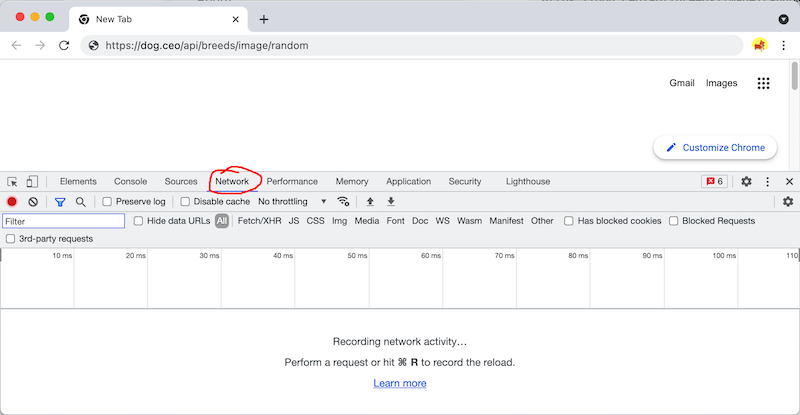
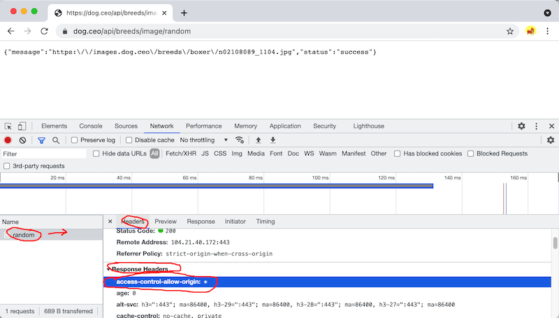

# How to check your API for CORS access

I. Overview
- CORS stands for "Cross-Origin Resource Sharing" - if a web service doesn't have it "turned on", then client-side JS (the kind we are writing in IGME-330) won't be able to downlad that web service
- https://developer.mozilla.org/en-US/docs/Web/HTTP/CORS
- *How do we know if a web service has CORS turned on?* By looking for a `access-control-allow-origin: *` HTTP response header - see below where we demo how to look for that header

1) **First, open the inspector and select the *Network* tab**

2) **Navigate to your API URL (You should see raw JSON in the browser):**

3) **In the Network tab, select the API URL:**

- Select the ***Headers*** tab (probably selected by default)
- Scroll down until you see the ***Response Headers*** section.
- Look for: `access-control-allow-origin: *`
- If you don’t see that, you will need to either find a different API or build a simple PHP proxy (see the iTunes Proxy demo in myCourses)
- If you don’t see any headers, try reloading the page

