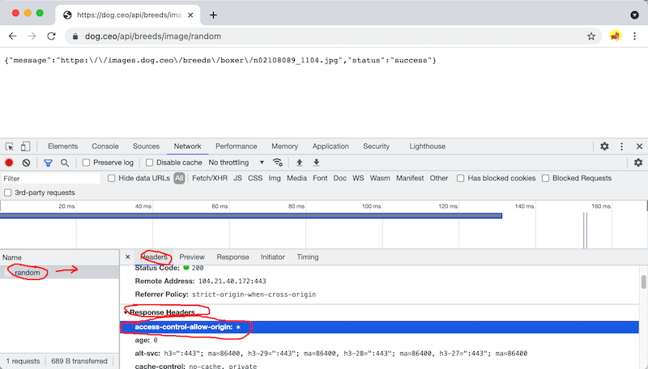

# How to check your API for CORS access

1) First, open the inspector and select the Network tab

2) Navigate to your API URL (You should see raw JSON in the browser)

3) In the Network tab, select the API URL

- Select the ***Headers*** tab (probably selected by default)
- Scroll down until you see the ***Response Headers*** section.
- Look for: `access-control-allow-origin: *`
- If you don’t see that, you will need to either find a different API or build a simple PHP proxy (see the iTunes Proxy demo in myCourses)
- If you don’t see any headers, try reloading the page

