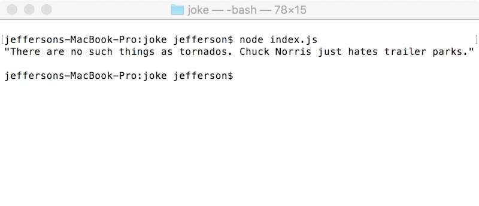
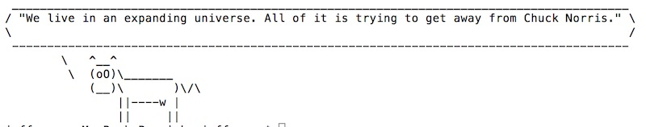

# Intro to Node.js - 1


## Video Link

- Video -> [Intro to Node.js - 1 (11:39)](https://rit.hosted.panopto.com/Panopto/Pages/Viewer.aspx?id=8026066f-26bf-47a3-b1c7-afc3012b596f)

<hr>


## Overview

- **Node.js** is a command-line JavaScript runtime built on Chrome's V8 JavaScript engine. Node.js uses an event-driven, non-blocking I/O model that makes it lightweight and efficient. Node.js' package ecosystem, [**npm**](https://www.npmjs.com/), is the largest ecosystem of open source libraries in the world
  - https://nodejs.org/en/
- Node.js runs on your local machine via the command line, or on a server, it does not run in the user's browser
- What can it do?
  - Run scripts and utilities on your local machine
  - Run web servers, socket servers, etc out there on the interwebs
  - And much more!
- Let's try out writing some simple local scripts first
  - in both IGME-235 & IGME-330 you have seen how we can access JSON web services from the web browser using JavaScript ...
  - we can also download web pages and services from the **command line** using [Node.js](https://nodejs.org/en/)
  - below we will work through a few examples, giving us more of a chance to work with both web services and Node.js

<hr>

## Contents

<!--- Local Navigation --->
I. [Install Node.js and npm (if you need to)](#section1)

II. ["Hello Node"](#section2)

III. [Downloading and displaying a simple "text" web service](#section3)

IV. [Have a cow!](#section4)

V. [Next Steps](#section5)

<hr><hr>

<a id="section1"></a>

## I. Install Node.js and npm (if you need to) 

- **Node.js** is a command-line JavaScript runtime built on Chrome's V8 JavaScript engine. Node.js uses an event-driven, non-blocking I/O model that makes it lightweight and efficient. Node.js' package ecosystem, **npm**, is the largest ecosystem of open source libraries in the world.
  - https://nodejs.org/en/
- **npm** is the package (i.e. "library") manager for JavaScript
  - https://www.npmjs.com
  - There are user-contributed packages for nearly *everything* that a JavaScript dev might want to do - where are links to some packages that we are using in this class (let's take a peek at these now):
    - https://www.npmjs.com/package/request (this one is *deprecated*, but don't worry about that)
    - https://www.npmjs.com/package/cowsay
    - https://www.npmjs.com/package/webpack
    - https://www.npmjs.com/package/babel-loader
    - https://www.npmjs.com/package/typescript
    - https://www.npmjs.com/package/webpack
    - https://www.npmjs.com/package/webpack-cli
    - https://www.npmjs.com/package/webpack-dev-server
    
  
To see if you already have **node** and **npm** installed on your computer, type the following in the console:

  ```js
  node -v
  npm -v
  ```
  
### A) How to install Node.js 
 
 - You can head to https://nodejs.org/en/download/ - and grab an installer - instructions are here:
   - https://docs.npmjs.com/getting-started/installing-node
 
 
### B) Test that `node` and `npm` are installed
 
 - When **Node.js** is installed, it also installs **npm** (*Node Package Manager*). Head to the command prompt (On a Mac use the *Terminal* application, on PC use *GitBash* or *Powershell* etc) to verify that `npm` is installed by typing:
 
   ```js
   node -v
   npm -v
   ```

 
 - ***At this point you should be ready to go!***
 
 <a id="section2"></a>
 
 <hr>
 
## II. "Hello Node"
 
 Let's write a "Hello world" command-line script to be sure `node` works on our machine:
 - create a folder named **hello**
 - inside of this folder create a new file named **index.js**
 - add one line of code to this file:

    ```js
    console.log("Hello node!");
    ```
  
 - in the console (or Terminal on Mac), change directory to the **hello** folder
 - type `node index.js` - you should now see the `"Hello node!"` message printed to the console

<hr>

<a id="section3"></a>
  
## III. Downloading and displaying a simple "text" web service

- We are going to keep this as bare-bones as possible, so we will just download a joke from a "random geek joke" web service. The web service will return the joke data in plain text format - here are the docs:
  - https://github.com/sameerkumar18/geek-joke-api
- and here is the URL to the service (click on the link to load it in browser, to be sure that it works):
  - https://geek-jokes.sameerkumar.website/api
  - **UPDATE:** ***If the above web service is "down", use this one instead***:
    - https://people.rit.edu/~acjvks/330/shared/php/get-joke.php

If you test the above link in a browser, you will see a random plain-text joke such as `"E-mail returned to sender... insufficient voltage."`


### A. Get started:
  - create a folder named **joke**
  - inside of the **joke** folder, create a file named **index.js**

<hr>

### B. Add the following to **index.js**:

```js
// #1 - import the request module, which is used to download data over http
const request = require('request');

// #2 - set our URL
let url = 'https://geek-jokes.sameerkumar.website/api';

// #3 - make the request
// the second parameter below is a callback function (an ES6 arrow function in this case)
// which is called when the data is downloaded
request(url, (err, response, body) => {
    // if there's no error, and if the server's status code is 200 (i.e. "Ok")
    if(!err && response.statusCode == 200){
    	// log out the plain-text joke - no parsing required!
        console.log(body);
    }
});
```
 
<hr>
 
### C. Open your console, and change directory to the **joke** folder. Run the script by typing:

  ```js
  node index.js
  ```

<hr>

### D. FAILURE!

- You should see a series of error messages that begin with **`Error: Cannot find module 'request'`** 
- This is happening because you never downloaded the files that **node** needs to actually import the `request` module code.

<hr>

### E. Download the **request** module files by typing this: 

(Make sure that you are still in the **joke** folder)
  
  ```js
  npm install request
  ```

- Downloading of files now should begin. Once downloading has completed, you will see a few warnings about a file named **package.json** missing - but npm will go and create it for you - we will address this in the next chapter.
- You should now see a folder named **node_modules** - open it up and you will that that there are approximately 50 sub-folders, including one named **request**. These additional folders are all of the modules that the **request module** is dependent on.
- You will see one more file - **package-lock.json**  - this file keeps track of all of the project modules and dependencies - you won't need to worry about for our examples - but if you wish you can read about it here: https://docs.npmjs.com/files/package-lock.json
- BTW - you can ignore the `request` deprecation warnings in the console - and if you are interested you can read about the issue here:
  - https://www.npmjs.com/package/request
  - https://nodesource.com/blog/express-going-into-maintenance-mode

<hr>

### F. Try to run the app again by typing:

  ```js
  node index.js
  ```

<hr>

**SUCCESS! - You should see a joke in the console - something like:**

  ```
  "The First rule of Chuck Norris is: you do not talk about Chuck Norris."
  ```




<a id="section4"></a>

<hr>

## IV. Have a cow!

- Have some fun with the **cowsay** package: https://www.npmjs.com/package/cowsay
- Import the package (add this to the top of **index.js**): `const cowsay = require("cowsay");`
- Install the package (type this on the command line): `npm install cowsay`
- Use the package by replacing - `console.log(body);` - with:

```js
console.log(cowsay.say({
	text : body,
	e : "oO"
}));
```

<hr>

**Which gives, when you run this in the console (by typing `node index.js`):**



<a id="section5"></a>

<hr>

## V. Next Steps

- There isn't too much more to do with this example right now, as this web service has but one entry point (i.e. it does 1 thing and accepts no additional parameters)
- Take a look inside the **node_modules** folder - you should now see a **cowsay** folder
- Also open up the **package.json** file that was created to see what's in there, which is a list of this app's code dependencies:

**package.json**
```
{
  "dependencies": {
    "cowsay": "^1.5.0",
    "request": "^2.88.2"
  }
}
```

<hr><hr>

**[Next Chapter -> Intro to Node.js (chapter 2)](intro-to-node-2.md)**

