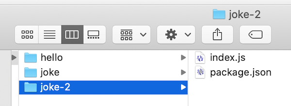
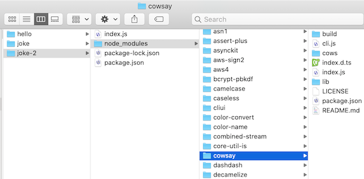

# Intro to Node.js - Part II

## Video Link

- Video -> [Intro to Node.js - 2 (09:35)](https://rit.hosted.panopto.com/Panopto/Pages/Viewer.aspx?id=a6182a8f-55e8-4ed2-b924-afc301341356)

<hr>

## Overview


- We are going to follow the usual development practice with node apps and create a **package.json** file
  - *The package.json file is the heart of Node.js system. It is the manifest file of any Node.js project and contains the metadata of the project. The package.json file is the essential part to understand, learn and work with the Node.js. It is the first step to learn about development in Node.js.*
    - https://www.geeksforgeeks.org/node-js-package-json/
  - https://docs.npmjs.com/cli/v9/configuring-npm/package-json

<hr>

## Contents

<!--- Local Navigation --->

I. [Creating the package.json file](#section1)

II. [Testing the package.json file](#section2)

III. [Editing the `"scripts":` key of package.json](#section3)

IV. [Check It Off](#section4)

<hr><hr>

<a id="section1"></a>

## I. Creating the package.json file

### A. Get started:

- Create a new folder named **joke-2**
- Copy over your completed **index.js** file (only) from the **joke** folder you created in **Intro to Node.js - Part I**
  - DO NOT copy the **node_modules** folder or any of the other files over to this new folder
- Change directory into the **joke-2** folder
- Type `node index.js`
  - this will once again FAIL - `Error: Cannot find module 'request' ...` - because you haven't installed the packages you need yet
  - this time we will address this issue in a different way - move on!

<hr>

### B. Create a Node project the usual way
- This time we are going to follow the standard Node.js development practice and first create a node project with **npm**:
  - if you need to, change directory into the **joke-2** folder
  - type:

```console
npm init -y
```

- This will create your **package.json** file with the default metadata about your project, which is stored in an object literal, and will look something like this:

**package.json**
```json
{
  "name": "joke-2",
  "version": "1.0.0",
  "description": "",
  "main": "index.js",
  "scripts": {
    "test": "echo \"Error: no test specified\" && exit 1"
  },
  "keywords": [],
  "author": "",
  "license": "ISC"
}
```

<hr>

- **Your file structure should look something like this:**



<hr>

### C. Download the **request** module 

- This time, we are going to download the **request** module, and then *save this dependency* into the **package.json** file:
  - make sure that your current working directory is still the **joke-2** folder
  - type the following in:

```console
npm install request --save
```

- This will download and install the **request** module and other dependencies to the **node_modules** folder just like last time
- The `--save` flag is what tells **npm** to add a `"dependencies":` key to **package.json**, which you can see if you open the file:

```json
"dependencies": {
    "request": "^2.88.2"
  }
```

- Note that we didn't get the warnings about the missing **package.json** file like we did last time
- PS: the `--save` flag has been *optional* for a few years now and can be omitted. This is because **npm** now adds the `"dependencies":` key to **package.json** automatically whenever you install new packages 


<hr>

### D. Download the **cowsay** module 
- If you try to run this app with `node index.js` - you'll again get an error that a package is missing - this time it would be `cowsay`
- Let's install `cowsay` as a dependency and download the files
  - as mentioned above you can actually omit `--save` - so go ahead and do it like the cool kids do by typing:
    - `npm i cowsay`
- The **package.json** `"dependencies"` key now includes `cowsay`:

```json
"dependencies": {
  "cowsay": "^1.5.0",
  "request": "^2.88.2"
}
```

- And if you look inside the **node_modules** folder - you should now see a **cowsay** folder

<hr>



<hr>

### E. Test the script

- Run the script to be sure that it still works as before:

```js
node index.js
```
 
 - Which should print out another "Chuck Norris" joke such as:
 
 ```
"Chuck Norris can do a roundhouse kick faster than the speed of light. This means that if you turn on a 
light switch, you will be dead before the lightbulb turns on."
 ```

<a id="section2"></a>

<hr>
 
 ## II. Testing the package.json file

- Delete your **node_modules** folder
- If you run your script again - go ahead an type `node index.js` - it fails! - because the **request** module and **cowsay** modules are nowhere to be found
- To re-install (*meaning, download*) the **request** and **cowsay** module files:
  - just type `npm install` (or `npm i` for short)
  - which will re-download the **request** and **cowsay** modules because they are both listed in the `"dependencies":` key of **package.json**
- run your script again - `node index.js` - it succeeds!

<a id="section3"></a>

<hr>

## III. Editing the `"scripts":` key of package.json

- Rather than having to remember exactly what to type in to run a particular node project, the usual practice is to create a `"start":` script in the **package.json** file
- Go ahead and add a `"start"`key to the `"scripts":` key in **package.json** and give it a value of `"node index.js"`

```json
"scripts": {
    "test": "echo \"Error: no test specified\" && exit 1",
    "start": "node index.js"
}
```
- Save the **package.json** file
- You can now run this command by typing:
  - `npm run start` (or just `npm start` for short)
  - Which should go ahead and run the app and display a joke
- Go ahead and type `npm run test` (or just `npm test` for short) - to see what the default `"test"` script does
  - which is just a console log at this point 
  - you can delete the `"test"` key/value if you want (because we are not going to be implementing any test scripts)
- NB: This is a simple app so creating a "start" script doesn't do much for us here, but ...
  - when you are working with more complex apps, creating this script is really helpful to yourself and others who are developing the app
  - Thus, whenever you download someone else's node project from the interwebs, you usually:
    - #1 - type in `npm i` to download all of the project dependencies
    - #2 - type in `npm start` to run the project
  
<a id="section4"></a>

<hr> 


## IV. Check It Off
- Make sure that everything still works in all 3 of these folders - **hello**, **joke** and **joke-2**
  - take a screenshot of the console output for **joke-2** (showing the cow ASCI art and so on) - save it as a JPEG or PNG file
  - ***IMPORTANT -->*** delete the **node_modules** folders in all 3 of the folders
- Create a new folder named ***lastName*-*firstInitial*-node-intro**
  - put the above 3 folders into this new folder
  - put the screenshot into this new folder
  - ZIP and Post this folder to the myCourses dropbox
- Rubric:
  - (-5%) for misnamed folder
  - (-50%) for missing screenshot

<hr><hr>

**[Previous Chapter <- Intro to Node.js (chapter 1)](intro-to-node-1.md)**

