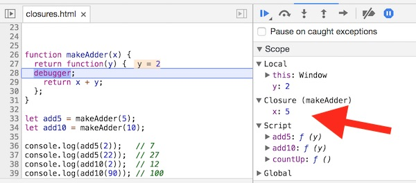
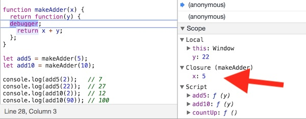

# JavaScript Notes

## I. Closures
- *A closure is the combination of a function and the lexical environment (i.e. scope) within which that function was declared.*
- Closures are created whenever a function is declared inside of another function - this means that closures are "everywhere" in your code.
- *A closure can also be though of as when a function "remembers" the variables around it even when that function is executed elsewhere (in a different scope).*
- Nested functions have access to variables declared in their outer scope.
- There are three scope chains the closure has access to:
  - its own scope (variables defined between its curly brackets)
  - the outer function's variables
  - global variables.

## II. `makeCounter()` - a simple example

We can't just *tell* you about closures, we have to *show* you:

**closure-1.html**
```js
function makeCounter(){
	let num = 0; // num is a local variable created by makeCounter()
	
	return function(){  // this function is returned by makeCounter()
		return num ++;  // this function has access to num and "remembers" its value
	}
}

let countUp = makeCounter();
console.log(countUp()); // 0
console.log(countUp()); // 1
console.log(countUp()); // 2
```

- `makeCounter()` is basically a factory function - it returns an anonymous "incrementing" function - in this case stored in the `countUp` variable. Everytime we invoke `countUp()`, we can see that the number increases by 1, which means that the value of `num` is being preserved with each call to `countUp()`
- the inner function of `makeCounter()` still has access to `num` and anything else within `makeCounter()`, that reference is called a *closure*.

And if we create a new variable named `countMore`, it will get its own copy of `num`:

```js
let countMore = makeCounter();
console.log(countMore()); // 0
console.log(countMore()); // 1
console.log(countMore()); // 2
```


## III. `makeAdder()` - another example

This example is from here: https://developer.mozilla.org/en-US/docs/Web/JavaScript/Closures#Closure

```js
function makeAdder(x) {
  return function(y) {
    return x + y;
  };
}

var add5 = makeAdder(5);
var add10 = makeAdder(10);

console.log(add5(2));  	// 7
console.log(add5(22));  // 27
console.log(add10(2)); 	// 12
console.log(add10(90)); // 100
```

-  `add5` and `add10` are distinct function *instances*
- in both of these instances the value of `x` (a parameter) is preserved

**Here are the results of both calls to `add5()`, note how `x` is the same for both invocations:**






## IV. Can we do something similar with ES6 classes?

**closure-2.html**

```js
class Adder{
	constructor(x){
		this.x = x;
	}
	
	add(y){
		return this.x + y;
	}
}

let add5 = new Adder(5);
let add10 = new Adder(10);

console.log(add5.add(2));  	// 7
console.log(add5.add(22));  	// 27
console.log(add10.add(2)); 	// 12
console.log(add10.add(90)); 	// 100
```

Sure!

- So why not just use classes instead of returning functions from functions and creating *closures*?
- The output of the code will be the same, but if we dig into the debugger we will see that the created `add5` variables are distinctly different kinds of objects, for example:
  - In the closure `add5`, `x` is completely private, and cannot be accessed or changed
  - But in `Adder` instance `add5`, the `x` property is both public and mutable.
  - This means that in some very important ways, the closure is more powerful than the `Adder` instance.

## V. Practical Closures
- check out the jsfiddle here: https://jsfiddle.net/vnkuZ/7726/
- earlier in the semester, we saw how IIFEs allowed us to have private properties and functions, and to only return those properties or functions we wanted to expose (make public)

**closure-3.html**
```js
	let lib = (function(){
		let a = "hello";
		let b = "private";
		
		function doStuff(){
			console.log(`Do Stuff! The value of b is "${b}"`);
		}
		
		// our public interface
		return{
			a: a,
			doStuff: doStuff
		}
	})();
	
lib.doStuff(); 		// Do Stuff! The value of b is "private"
console.log(lib.a); 	// hello
console.log(lib.b); 	// undefined
```

- Go ahead and put a breakpoint in `doStuff()` - you will see that `b` is a *closure* variable.

## VI. References
- https://developer.mozilla.org/en-US/docs/Web/JavaScript/Closures
- [You Don't Know JS: Scope & Closures](https://github.com/getify/You-Dont-Know-JS/blob/master/scope%20%26%20closures/ch5.md)
