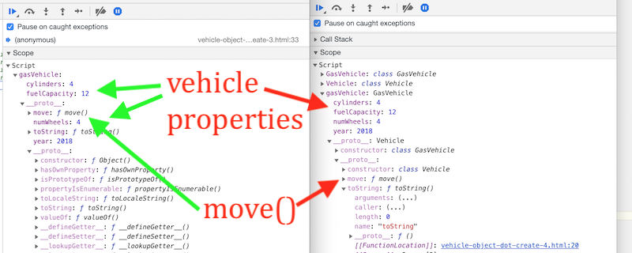

# JavaScript Prototype Chain

## Overview - JavaScript classes are "syntactic sugar"
- *JavaScript classes, introduced in ECMAScript 2015, are primarily syntactical sugar over JavaScript's existing prototype-based inheritance. The class syntax does not introduce a new object-oriented inheritance model to JavaScript.* 
  - MDN Web Docs: https://developer.mozilla.org/en-US/docs/Web/JavaScript/Reference/Classes

### So how do JavaScript classes work?
- Behind the scenes, the JavaScript compiler uses JavaScript's *prototype-based inheritance* as a way to override or extend object behavior. 
- Below is from https://developer.mozilla.org/en-US/docs/Web/JavaScript/Inheritance_and_the_prototype_chain

**JavaScript objects are dynamic "bags" of properties (referred to as *own* properties). JavaScript objects have a link to a *prototype object*. When trying to access a property of an object, the property will not only be sought on the object but on the *prototype* of the object, the prototype of the prototype, and so on until either a property with a matching name is found or the end of the prototype chain is reached.**

To learn how to override or extend object behavior in JavaScript - read below!

<hr>

## Contents
<!--- Local Navigation --->
I. [`Object.prototype`](#section1)

II. [`Object.create()`, Delegation & OLOO - "Objects Linked to Other Objects"](#section2)

III. [Sprites & Circle Sprites](#section3)

IV. [Square Sprites](#section4)

V. [Image Sprites](#section5)

VI. [Review Questions](#section6)

VII. [Review Exercise](#section7)

<hr>

<a id="section1"> 
	
## I.`Object.prototype`

The `Object.prototype` property points at the *Object prototype object*. (what?)

What is a prototype object? Here is an excerpt from this MDN page: https://developer.mozilla.org/en-US/docs/Web/JavaScript/Reference/Global_Objects/Object/prototype

*A typical object inherits properties (including methods) from Object.prototype, although these properties may be shadowed (a.k.a. overridden).*

*Changes to the Object prototype object are seen by all objects through prototype chaining, unless the properties and methods subject to those changes are overridden further along the prototype chain.  This provides a very powerful although potentially dangerous mechanism to override or extend object behavior.*

<hr>

### I-A. The "default" prototype chain

**Let's see what the default prototype object is on our simple `vehicle` object below. This code:**

**vehicle-object-dot-create-1.html**
```html
<!DOCTYPE html>
<html lang="en">
<head>
	<meta charset="utf-8" />
	<title>Vehicle-1 Object.create()</title>
</head>
<body>
<script>
let vehicle = {
  year: 2018,
  numWheels: 4,
  move(){
    console.log("Moving the vehicle now");
  }
};

console.log(vehicle.toString());
debugger;
</script>
</body>
</html>
```

**Gives us this in the debugger:**


<hr>

### I-B. Discussion

- above we see that the `year`, `numWheels` and `move` properties are on the main part of the object, and that under the `__proto__` property is the *prototype object*, which gives us the implicit built-in in properties (methods in this case) of `Object`. 
- the `year`, `numWheels` and `move` properties of `vehicle` are referred to as "own" properties. You can think of "own" properties as the properties that are explicitly defined on that object,and not on one of its prototypes.
- if we try to access a property or method that does not exist on the main object, the property will be sought on that object's *prototype*. This behavior of walking the prototype objects and seeking properties is called the *prototype chain*. 

Below is from https://developer.mozilla.org/en-US/docs/Web/JavaScript/Inheritance_and_the_prototype_chain

**Each object has a private property which holds a link to another object called its *prototype*. That prototype object has a prototype of its own, and so on until an object is reached with `null` as its prototype. By definition, `null` has no prototype, and acts as the final link in this prototype chain.**

<hr>

### I-C. An example of the prototype chain in action
So what do we get when we call `toString()` on `vehicle` like this:

`console.log(vehicle.toString());`

We get: 

`[object Object]`

in the console - which isn't too exciting, but indicates that `vehicle` "inherited" `toString()` from its prototype object.

<hr>

### I-D. Property shadowing
You can use *property shadowing* to create a form of method overriding. Below we will give `vehicle` its own version of `toString()`, which will "shadow" the default implementation of `toString()` in the prototype object.

**vehicle-object-dot-create-2.html**
```html
<!DOCTYPE html>
<html lang="en">
<head>
	<meta charset="utf-8" />
	<title>Vehicle-2 Object.create()</title>
</head>
<body>
<script>
let vehicle = {
  year: 2018,
  numWheels: 4,
  move(){
    console.log("Moving the vehicle now");
  },
  toString(){ // NEW!
  	return "Year: " + this.year + ", numWheels: " + this.numWheels;
  }
};

console.log(vehicle.toString());
</script>
</body>
</html>
```

Which gives: 

`Year: 2018, numWheels: 4` 

in the console, and confirms that vehicle's version of `toString()` shadowed the prototype's version. 

If you check the debugger, you will also see that there is a `toString` property on the top level of the object (as an "own" property).

<hr>

<a id="section2">
	
## II. `Object.create()`, Delegation & OLOO - "Objects Linked to Other Objects"

Now let's see how `Object.create()` will allow us to specify an instance's prototype object, rather than relying on the default prototype object.

The `Object.create()` method creates a new object with the specified prototype object and properties.

- https://developer.mozilla.org/en-US/docs/Web/JavaScript/Reference/Global_Objects/Object/create
	
**vehicle-object-dot-create-3.html**

```html
<!DOCTYPE html>
<html lang="en">
<head>
	<meta charset="utf-8" />
	<title>Vehicle-3 Object.create() plus .prototype</title>
</head>
<body>
<script>
// Our "base" object
let vehicle = {
  year: 2018,
  numWheels: 4,
  move(){
    console.log("Moving the vehicle now");
  },
  toString(){
  	return "Year: " + this.year + ", numWheels: " + this.numWheels;
  }
};

// gasVehicle's prototype is vehicle
let gasVehicle = Object.create(vehicle);
	
// add specialized properties to our base object
gasVehicle.cylinders = 4;
gasVehicle.fuelCapacity = 12;

// call properties and methods on the `gasVehicle` object
console.log(gasVehicle.cylinders); 	// .cylinders is "own" property
gasVehicle.move(); 			// .move() is in the prototype (i.e. `vehicle`)
console.log(gasVehicle.valueOf()); 	// .valueOf() is in the prototype's prototype (the default prototype object)
console.log(gasVehicle.__proto__ == vehicle); // true!
debugger;
</script>
</body>
</html>
```

**Gives us this in the debugger:**


**And this in the console:**

```javascript
4
Moving the vehicle now
{cylinders: 4, fuelCapacity: 12}
true
```

<hr>

### II-A. Discussion
- Above we can see that we have created a form of inheritance, where `gasVehicle` "inherits" properties from `vehicle`, and `vehicle` inherits properties from the default prototype object.
- we can implement a form of overriding through property "shadowing" - properties added to `gasVehicle` will replace properties that are declared in its prototype objects. 
- but "inheritance" isn't really the right term for this extending of object behavior, "delegation" is a better term - read on!

<hr>

### II-B. Delegation & OLOO - "Objects Linked to Other Objects"
In JavaScript, the prototype chain **links objects to other objects** 

The technique we have shown above uses *behavior delegation* to either extend or override state and behavior received from other objects. Objects *delegate* certain behavior to other objects, above, `gasVehicle` *delegated*  its `move()` method to `vehicle`. 

These posts are required reading:
- https://stackoverflow.com/questions/29788181/kyle-simpsons-oloo-pattern-vs-prototype-design-pattern
- https://github.com/getify/You-Dont-Know-JS/blob/master/this%20&%20object%20prototypes/ch6.md#delegation-theory

<hr>

<a id="section3">
	
## III. Creating `Vehicle` & `GasVehicle`  classes

- Below we will now use ES6 classes to model the same inheritance hierarchy

**vehicle-classes-4.html**

```html
<!DOCTYPE html>
<html lang="en">
<head>
	<meta charset="utf-8" />
	<title>Vehicle-4 ES6 Classes & Inheritance</title>
</head>
<body>
<script>

class Vehicle{
	constructor(year,numWheels){
		this.year = year;
		this.numWheels = numWheels;
	}
	
	move(){
    console.log("Moving the vehicle now");
  }
  
  toString(){
  	return "Year: " + this.year + ", numWheels: " + this.numWheels;
  }
}

class GasVehicle extends Vehicle{
	constructor(year,numWheels,cylinders,fuelCapacity){
		super();
		// slick way to assign values to properties
		Object.assign(this, {year,numWheels,cylinders,fuelCapacity});
	}
}

let gasVehicle = new GasVehicle(2018,4,4,12);

console.log(gasVehicle.cylinders);
gasVehicle.move();
console.log(gasVehicle.valueOf());
console.log(gasVehicle.__proto__.__proto__.constructor == Vehicle); // true;

debugger;
</script>
</body>
</html>
```

**Gives us this in the debugger (the left side is OLOO, the right side is ES6 classes):**




**And this in the console:**

```js
4
Moving the vehicle now
GasVehicle {year: 2018, numWheels: 4, cylinders: 4, fuelCapacity: 12}
true
```

### II-A. Discussion
- In the screenshot above we can see that the left side (OLOO & delegation) and the right side (ES6 classes and inheritance) are nearly identical, except:
  - the properties from the class version are all on the top level object ...
  - we have additional `Constructor` functions in the class version ...
  - but behind the scenes, the two object construction approaches both use the JavaScript prototype chain 


<hr>

**Note: If you are interested in creating "inheritance hierarchies" with `Object.create()`, check out this post: http://techsith.com/category/object-setprototypeof/**


