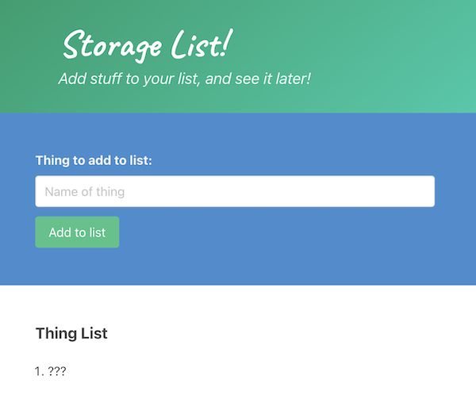
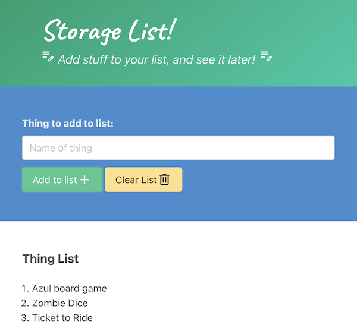
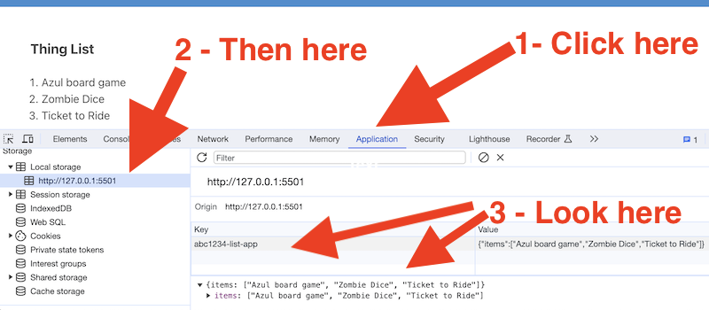

# `localStorage` Practice - *Storage List!*

## I. Overview

- The `localStorage` API allows developers to read/write app data to a user's browser, and this data will persist between browser sessions until deleted by the user, or by JavaScript
  - https://developer.mozilla.org/en-US/docs/Web/API/Window/localStorage
- Note that `localStorage` is specific to the document's *origin* - which is the domain name, protocol (http or https) and port
  - https://developer.mozilla.org/en-US/docs/Glossary/Origin
  - meaning that `http://localhost:5500` and `http://localhost:5501` have different localStorage objects
- ***`localStorage` is not very secure:***
  - it is accessible through JavaScript on the same domain - for example people.rit.edu
  - this means that ***any*** JavaScript running on the people.rit.edu domain will have access to your `localStorage` data
  - and because of this your localStorage data can also be vulnerable to cross-site scripting (XSS) attacks
- Meaning:
  - don't store anything sensitive in `localStorage` (for example, passwords)
  - for apps deployed to shared domains like people.rit.edu, be sure to store your data under unique keys, so that someone else's JS doesn't overwrite your data
    - for example `highscores` is a terrible key name for your data
    - `abc1234-highscores` (where abc1234 is your id) would be better
- We've covered this before - [IGME-235 - Web Apps 9 - WebStorage API](https://github.com/tonethar/IGME-235-Shared/blob/master/tutorial/web-apps-9.md)
 
---

## II. Start Files

- The start files are here -&gt; [local-storage-practice-start.zip](_files/local-storage-practice-start.zip)
- Take a look at **storage.js** -  it's 100% complete - here are the 2 "public" functions you will need to call from **main.js**:
  - `writeToLocalStorage(key, value)`
  - `readFromLocalStorage(key)`
- Note: this code saves every key/value pair you pass to it as a property on a single JSON object
  - in the last screenshot of this page you can see that we are saving an array of strings under an `"items"` key
  - you could also add other keys if you wished, for example copies of deleted lists that the user could recover if they wished

  
**Screenshot of starting state of *Storage List*:**




---

## III. Completed Version

- Completed functionality
  - Click "Add to List" button to add contents of `<input>` to the visible *Thing List*
  - Click "Clear List" button to clear the list (empty the array) - you will need to create this button yourself
  - Whenever changes are made to the list (the 2 actions above) be sure to save the current list to `localStorage` using `writeToLocalStorage(key, value)`
  - When the page loads be sure to load in the last-saved list from `localStorage` with `readFromLocalStorage(key)`, and display it
  - See code comments in **main.js** and screenshots below for hints:
    - be sure to change the value of `storeName` (in **storage.js**) to something that's unique
    - be sure to utilize the `items` array while doing all of this
  - Be sure that the app works in a "first run" scenario where the `items` array has not yet been saved to localStorage:
    - meaning, if the data that was loaded from localStorage is not an array, `items` will be initialized as an empty array
    - you can use [`Array.isArray()`](https://developer.mozilla.org/en-US/docs/Web/JavaScript/Reference/Global_Objects/Array/isArray) to test this
    - be sure to test your code at some point by deleting the `localStorage` data in the web inspector, and reloading the app. It should still function, with no inital items. And the user should be able to add items and have them saved to `localStorage`

---

**Screenshot of the completed *Storage List*:**



---

**Screenshot of what local storage looks like in the browser when you are successfully saving to it**



---

## IV. Optional - want "material" icons for your buttons and heading?

- https://developers.google.com/fonts/docs/material_symbols
- https://fonts.google.com/icons

```html
<link href="https://fonts.googleapis.com/css2?family=Material+Symbols+Outlined" rel="stylesheet" />

...

<button id="btn-add" class="button is-success">
  Add to list
  <span class="material-symbols-outlined">Add</span>
</button>


...

<h2 class="subtitle is-italic">
  <span class="material-symbols-outlined">edit_note</span> 
    Add stuff to your list, and see it later!
  <span class="material-symbols-outlined">edit_note</span> 
</h2>
```

---

## V. Submission
- When you are done and it is working perfectly, rename the containing folder to ***lastName*-*firstInitial*-local-storage** and ZIP it up
- Post to myCourses dropbox


  
