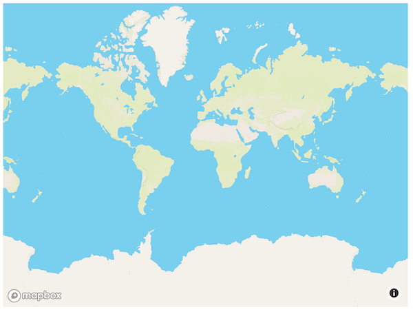
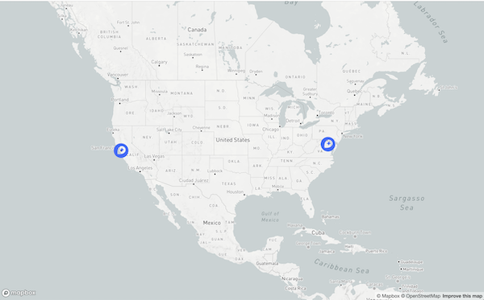
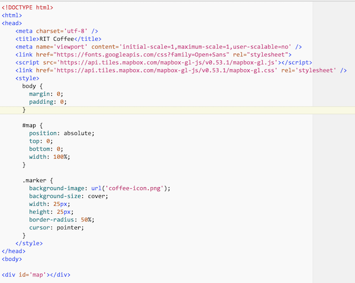
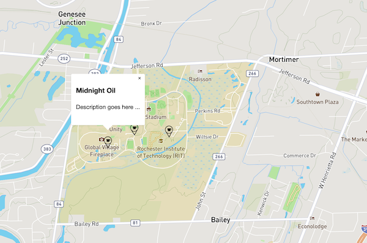

# Mapbox Intro


- An alternative to google maps is Mapbox - let's check it out.


## I. Get Started

1. Sign up for an account here: https://account.mapbox.com/auth/signup/
2. On the account page - https://account.mapbox.com - set up a Maps SDK (Web) Account
  - Use the Mapbox CDN
  - Follow the instructions to build a simple map HTML page - be sure to copy over your ***access token***


Here's what the HTML page will look like - you'll need to add your ***access token*** to it:

**mapbox-simple.html**

```html
<!DOCTYPE html>
<html lang="en">
<head>
	<meta charset="utf-8" />
	<title>Mapbox Simple</title>
	<script src='https://api.mapbox.com/mapbox-gl-js/v0.53.0/mapbox-gl.js'></script>
	<link href='https://api.mapbox.com/mapbox-gl-js/v0.53.0/mapbox-gl.css' rel='stylesheet' />
</head>
<body>
<div id='map' style='width: 640px; height: 480px;'></div>
<script>
	mapboxgl.accessToken = 'PUT-YOUR-TOKEN-HERE';
	var map = new mapboxgl.Map({
		container: 'map',
		style: 'mapbox://styles/mapbox/streets-v11'
	});
	
</script>
</body>
</html>
```

Screenshot of **mapbox-simple.html** (I changed the width & height in my version):



## I-A. Some things to try

- Change the map's `style` - https://docs.mapbox.com/mapbox-gl-js/example/setstyle/ - by changing `streets-v11` above to 
  - `light-v10` OR
  - `dark-v10` OR
  - `outdoors-v11` OR
  - `satellite-v9`
- Change the `center` and `zoom` of the map:

```js
map.setZoom(9);
map.setCenter([-77.6799,43.083848]); // note the order - it's longitude,latitude - which is opposite of Google Maps
```

<hr>

## II. Add Clickable Markers

- Here is a marker icon you will need --> 

- Follow this tutorial here - https://docs.mapbox.com/help/tutorials/custom-markers-gl-js/ - which give you something that looks like this:



<hr>

## III. RIT Coffee Map

- Here is a marker icon you will need --> 
- To get started on the RIT coffee map, we just have to slightly modify the above turorial - here's a screenshot of the code, and the final result (with 3 coffee shops showing)

**rit-coffee-mapbox.html**




Screenshot of **rit-coffee-mapbox.html**:




