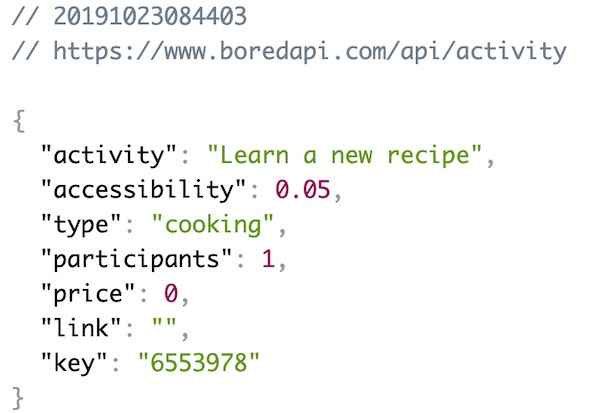

# Node.js and Web Services - 2

## Overview

This time we are going to look at how to download a different web service, in this case an "what to do when you are bored" service. Although this sounds really similar to what we did last time, there are differences that will make this more challenging:

- we are going to create a **package.json** file this time
- the data is in the JSON format so we will need to parse it before displaying it
- the web service takes parameters, such as the number of participants in the activity:
  - this means we will need to format the URL differently
  - we will need to give the user of this script the ability to choose how many participants they have for the activity (i.e. pass arguments to the web service)

## Contents

<!--- Local Navigation --->
I. [Preview our new web service](#section1)

II. [Working with the package.json file](#section2)

III. [Utilize the "inspirational design quotes" service](#section3)

IV. [Turning our script into a command line tool](#section4)

V. [Homework](#section5)

<hr>

<a id="section1"></a>

## I. Preview our new web service
- The documentation of this web service is here: https://www.boredapi.com/documentation
- An API key is not required to use this web service
- To see the web service in action, bring up a new window in Chrome and open this URL:

```
https://www.boredapi.com/api/activity
```

- which gives you 1 random activity that looks like this:



- as you can see above, we are probably most interested in the `.activity` and `.type` and `.participants` properties
- If your JSON isn't as nicely formatted as mine, it's because I am using the Chrome JSON Viewer extension which you can get here: https://chrome.google.com/webstore/detail/json-viewer/gbmdgpbipfallnflgajpaliibnhdgobh

<a id="section2"></a>

## II. Working with the package.json file

### A. Get started:

- create a new folder named **bored**
- copy over your completed **index.js** file from Node.js and Web Services - Part I (but leave out the **cowsay** `require()` and the call to `cowsay.say()`)


### B. Create a node project the usual way
- this time we are going to follow the standard Node.js development practice and create a node project with **npm** - go ahead and change directory into the **bored** folder and type:

```js
npm init -y
```

This will create your **package.json** file with the default metadata about your project, which is stored in an object literal, and will look something like this:

```js
{
  "name": "bored",
  "version": "1.0.0",
  "description": "",
  "main": "index.js",
  "scripts": {
    "test": "echo \"Error: no test specified\" && exit 1"
  },
  "keywords": [],
  "author": "",
  "license": "ISC"
}
```

### C. Download the **request** module 

This time, we are going to download the **request** module, and then *save this dependency* into the **package.json** file. Type the following in:

```js
npm install request --save
```

- This will download and install the **request** module and other dependencies to the **node_modules** folder just like last time
- The `--save` flag is what tells npm to add a `"dependencies":` key to **package.json**, which you can see if you open the file:

```js
"dependencies": {
    "request": "^2.88.0"
  }
```

- note that we didn't get the warnings about the missing **package.json** file like we did last time
- PS: the `--save` flag has been *optional* for a few years now and can be omitted. npm now adds the `"dependencies":` key to **package.json** automatically whenever you install new packages 

### D. Test the script

- Run the script to be sure that it still works as before:

```js
node index.js
```
 
 - Which should print out another "geek" joke such as:
 
 ```
"Chuck Norris can do a roundhouse kick faster than the speed of light. This means that if you turn on a 
light switch, you will be dead before the lightbulb turns on."
 ```
 
### E. Test package.json

- delete your **node_modules** folder
- if you run your script again - go ahead an type `node index.js` - it fails! - because the **request** module is nowhere to be found
- to re-install the **request** module files - just type `npm install` - which will re-download the **request** module and its dependencies because it is listed in the `"dependencies":` key of **package.json**
- run your script again - `node index.js` - it succeeds!

<a id="section3"></a>

## III. Utilize the "Bored API" service

Now that we have our script and **package.json** file working with the "random geek joke" web service, it's time to get it working with our new "Bored API" web service.

### A. Modify the code to request a variable number of participants

Change section #2 of **index.js** so it looks like this: 

```js
// #2 - set our URL
let url = "http://www.boredapi.com/api/activity?participants=";
let numParticipants = 1; // let's make 1 the default, but we'll let the user change it later
url += numParticipants; // concatenate `numParticipants` to the end of the query string
```


### B. Convert the downloaded text to a parsable object

- The "Chuck Norris joke" web service returned plain text, but this one returns the data as a JSON string
- We need to convert this string to an object before we can parse it - `JSON.parse()` accomplishes this for us
- Go ahead and change section #3 of **index.js** so it looks like this: 

```js
// #3 - make the request
// the second parameter below is a callback function (an ES6 arrow function in this case)
// which is called when the data is downloaded
request(url, (err, response, body) => {
    // if there's no error, and if the server's status code is 200 (i.e. "Ok")
    if(!err && response.statusCode == 200){
    	// A - convert the downloaded text to a JavaScript Object (in this case an array)
        let obj = JSON.parse(body); 
    
        // B - grab the `.activity` property of the first result
        let text = obj.activity;
        
        // C - log it out
        console.log(text);
      }
});
```

### C. Test the code

- Go ahead and type `node index.js` to run the code - it should successfully download the text, convert it to JSON, parse out the content, and log it to the console. You should see something like this:

```
Clean out your garage
```

<a id="section4"></a>

## IV. Turning our script into a command line tool

Things we are going to do in this section:
- Display the `.type`
- Display `.participants`
- Parse the first command line argument, and fetch activities with that number of participants
- Make **index.js** a command line script (tool) named **i-am-bored** that we can run from anywhere just by typing `i-am-bored`

### A. Display the `.type`
- ***Write the code to do this!***

### B. Display `.participants`
- ***Write the code to do this!***

<hr>

***Here's what mine looks like - I added a little formatting***


<hr>

### C. Parse the first command line argument, and only show that number of activities

- Here's a great article walking through how to do this - https://medium.com/netscape/a-guide-to-create-a-nodejs-command-line-package-c2166ad0452e - but we'll give you specific instructions below

#### i. Add the [Shebang](https://en.wikipedia.org/wiki/Shebang_(Unix)) line to the top (line #1) of index.js

```
#!/usr/bin/env node
```

- This is the path to the node executable that will parse and run the code in the **index.js** file
- [Wikipedia - Shebang](https://en.wikipedia.org/wiki/Shebang_%28Unix%29)

#### ii. Parse out the first command line argument

Replace the `numParticipants` line with this:

```js
let numParticipants = process.argv[2] || 1; // 1 will be the default
```

- `process.argv` is an array of the command line arguments the user typed - the third element in this array is the first argument that is passed *after* the name of the script. Read about this here:  https://nodejs.org/api/process.html#process_process_argv

#### iii. Test the script

- type `node index.js` and you should see an activity for 1 participant (the default)
- type `node index.js 5` and you should see an activity for 5 participants
- and so on ...

### D. Make the script an executable tool (and not have to type `node` first)

- make **index.js** *executable* by typing (only required in Unix land, you don't need to do this on Windoze):

    ```
    chmod +x index.js
    ```

- test **index.js** by typing `./index.js 5` - which should give you an activity for 5 participants

- now make **index.js** globally executable by adding the following key to **package.json**:

```js
"bin":{
  	"i-am-bored": "./index.js"
  }
```
- `"i-am-bored"` above is the name of the command
- create the link by typing `npm link` on the command line (Mac users will need `sudo` at the beginning)

- ***Test it! Type `i-am-bored 5` from any directory - now the script should run from anywhere!***

- ***Note:  `npm link` will likely fail on the lab machines :-(  but this won't hurt your HW grade because we will be looking for the `bin` key in package.json to verify that you at least tried to get it to work***

**PS - And when you want to "unlink" this command, simply run `npm unlink` from the *bored* folder to remove the `i-am-bored` alias**

<a id="section5"></a>

## V. Homework
Out of 10 points.
- Make sure that everything we asked for in Section IV. is working:
  - Display the activity (1 point)
  - Display the type (1 point)
  - Display the number of participants (1 point)
  - Parse the first command line argument, and show actitivites for that number of participants (2 points)
  - Make **index.js** a command line script (tool) named **i-am-bored** that we can run from anywhere just by typing `i-am-bored` (2 points)
- Also be sure that everything is formatted nicely - add spacing where appropriate - and recall that `\n` in a string is the new line character (3 points)


**ZIP and POST to Dropbox**
<hr><hr>

**[Previous Chapter <- Node.js and Web Services (chapter 1)](node-and-web-services-1.md)**

