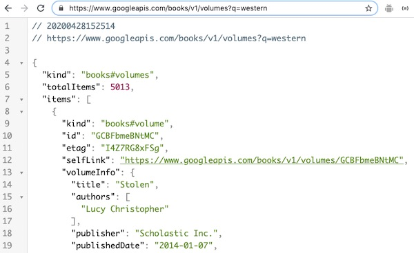
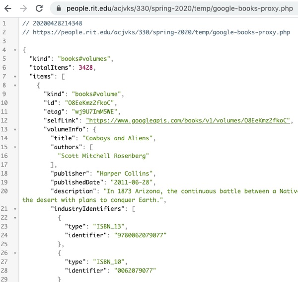
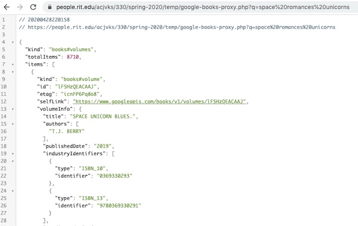

# Simple Proxy Server

## I. Overview 

- the **shout-proxy.php** server from [HW-php-web-service-5.md](./HW-php-web-service-5.md) was used to download data from the SHOUTIFY web service
- the SHOUTIFY web service is problematic (and not typical) because it requires POST requests, where any additional parameters must be passed in a separate file
- what if the web service you have just uses plain old GET requests (where the web service parameters are encode in the query string) - how do you handle it?
- much more simply! see below!

<hr>

## II. The web service we need to download
- The google books API is free and easy to use - go check it out now - here we are passing in a `q` parameter with a value of `books`:
  - https://www.googleapis.com/books/v1/volumes?q=western
  - see the first screenshot below
- But there's one major issue with this web service - CORS is NOT turned on:
  - we know this because the `Access-Control-Allow-Origin: *` header is missing (see the second screenshot below)
  
  <hr>
  
  
  
  <hr>
  
  
   
  <hr>
   
 ## III. Our Google Books Proxy Server
   
   - Here is our proxy server - note how much simpler the PHP code compared to the code from [HW-php-web-service-5.md](./HW-php-web-service-5.md) that was used to download from the SHOUTIFY web service
   
**google-books-proxy.php**
   
```php
   <?php
	  $q = "space alien westerns"; // hard-coded
	  // Spaces are not allowed in URLS - so we need to write code to handle that issue
	  // in case the user of this script passes in a value with spaces
	  // this next line of code will change any spaces that are passed into
	  // the script into %20 - which is the hexadecimal for 32 - which is the 
	  // ASCI value of a space.
	  // Try commenting out the `$q = rawurlencode($q);` line - you'll get an error
	  // https://www.php.net/manual/en/function.rawurlencode.php
	  $q = rawurlencode($q);
	  $URL = "https://www.googleapis.com/books/v1/volumes?q=$q";
	  $result = file_get_contents($URL, false);

	  header('content-type:application/json'); // tell the requestor that this is JSON
	  header("Access-Control-Allow-Origin: *"); // turn on CORS so that our client doesn't have to be on banjo to use this proxy server
	  echo $result;
  ?>
```
  
<hr>

- here's the working URL and a screenshot: https://people.rit.edu/acjvks/330/spring-2020/temp/google-books-proxy.php

<hr>
  


<hr>

   
## IV. What's left to do?

- Right now this proxy server is only going to download info about "space alien westerns" books
- So YOU need to write code to pass in a `q` parameter to the PHP script, which will contain a search term
- It's easy! - look back at this exercise for review on how to grab the `$_GET` parameters from the query string:
  - [HW-php-web-service-4.md#query-string](./HW-php-web-service-4.md#query-string)
 - When you are done, your script should function like this, (note that it can handle the spaces in the "space romances unicorns" search term we used in the example):
 
 <hr>
  


<hr>
