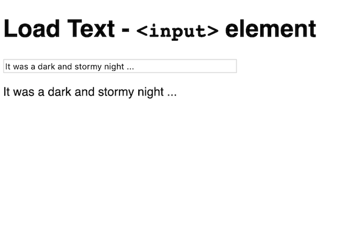
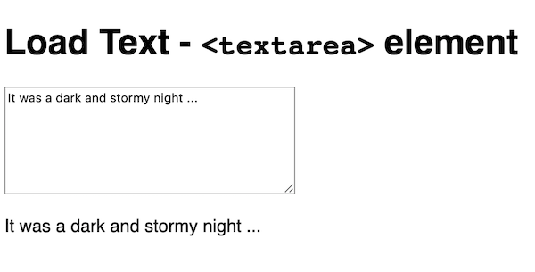
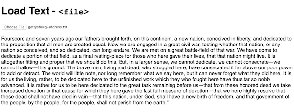
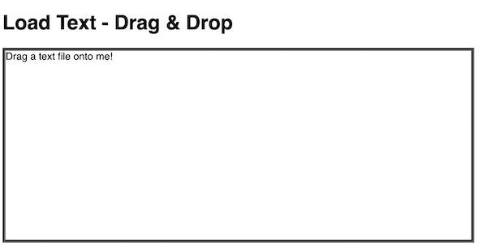
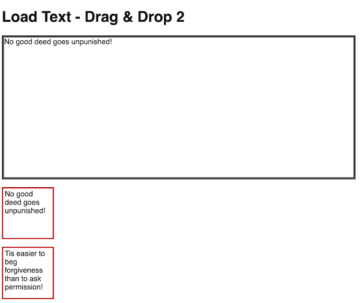
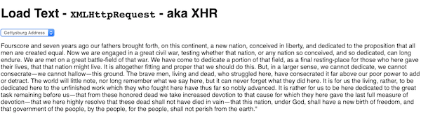

# 1 - Loading plain text

- Today we will first look at a number of ways for our users to load *unstructured* (plain) text
- We will then look at some ways to analyze and manipulate the text
- We won't need to use all of these text loading methods today - this code is a resource - "start code" - that we will come back to over the next few weeks
- N.B. - in week 10 we will start looking at *structured* text in formats such as CSV, XML, and JSON

I. [Six ways to Load Text](#I)
  
  - A. [Using &lt;input type="text">](#I-A) for single-line text
  - B. [Using &lt;textarea>](#I-B) for multi-line text
  - C. [Using &lt;file> input](#I-C) to load local files
  - D. [Using Drag & Drop](#I-D) to load local files
  - E. [Using Drag & Drop another way](#I-E) to load text contained HTML elements
  - F. [Using XMLHttpRequest](#I-F) - (aka XHR) to load files from a web server
  
II. [Lecture & Demo](#II)

III. [Homework](#III)

<hr><hr>

<a id="I"></a>

## I. Six ways to load text

- Let's look at multiple ways the user can load text into our app 

<a id="I-A"></a>

### I-A. Using &lt;input>

- a text input field for a single line of text



**load-text-input.html**

```html
<!DOCTYPE html>
<html lang="en">
<head>
	<meta charset="utf-8" />
	<title>Load Text - &lt;input></title>
	<style>
		body{font-family:sans-serif;}
	</style>
</head>
<body>
<h1>Load Text - <code>&lt;input></code> element</h1>
<section>
	<p><input id="input" type="text" size="50" maxlength="50" autofocus value="It was a dark and stormy night ..." /></p>
	<p id="output"></p>
</section>
<script>
let input = document.querySelector("#input");
let output = document.querySelector("#output");

input.oninput = doInput; // called whenever the content of the field changes
input.onchange = doChange; // called when the field loses focus or when the return key is pressed
input.dispatchEvent(new Event("input")); // calls doInput() when the page first loads

function doInput(e){
	let text = e.target.value;
	output.innerHTML = text;
}

function doChange(e){
	output.innerHTML = "The input field no longer has focus, or you hit `return`!";
}

</script>
</body>
</html>
```

<hr>

<a id="I-B"></a>

### I-B. Using &lt;textarea>

- Use a &lt;textarea> element for multi-line text



**load-text-textarea.html**

```html
<!DOCTYPE html>
<html lang="en">
<head>
	<meta charset="utf-8" />
	<title>Load Text - &lt;textarea></title>
	<style>
		body{font-family:sans-serif;}
	</style>
</head>
<body>
<h1>Load Text - <code>&lt;textarea></code> element</h1>
<section>
	<p><textarea cols="40" rows="7">It was a dark and stormy night ...</textarea></p>
	<p id="output"></p>
</section>
<script>
let input = document.querySelector("textarea");
let output = document.querySelector("#output");

input.oninput = doInput; // called whenever the content of the field changes
input.onchange = doChange; // called when the field loses focus or when the return key is pressed
input.dispatchEvent(new Event("input")); // calls doInput() when the page first loads

function doInput(e){
	let text = e.target.value;
	output.innerHTML = text;
}

function doChange(e){
	output.innerHTML = "The input field no longer has focus!";
}

</script>
</body>
</html>

```

<hr>

<a id="I-C"></a>

### I-C. Using &lt;file> input

- This example loads text files from the users hard drive



**load-text-file-input.html**

```html
<!DOCTYPE html>
<html lang="en">
<head>
	<meta charset="utf-8" />
	<title>Load Text - &lt;file></title>
	<style>
		body{font-family:sans-serif;}
	</style>
</head>
<body>
<h1>Load Text - <code>&lt;file></code></h1>
<section>
	<input type="file" id="fileChooser">
	<p id="output"></p>
</section>
<script>
let output = document.querySelector("#output");
document.querySelector("#fileChooser").onchange = doChange;


function doChange(e){
	let file = e.target.files[0]; // we are only allowing 1 file to be chosen
	let reader = new FileReader();
	reader.onload = dataLoaded;
	reader.readAsText(file);
}

function dataLoaded(e){
	let s = e.target.result;
	output.innerHTML = s;
}

</script>
</body>
</html>
```

<hr>

<a id="I-D"></a>

### I-D. Using Drag & Drop

- This example loads text files from the users hard drive, but in this case they do this by dragging and dropping a file onto the "drop target"



**load-text-drag-drop.html**

```html
<!DOCTYPE html>
<html lang="en">
<head>
	<meta charset="utf-8" />
	<title>Load Text - Drag & Drop</title>
	<style>
		body{font-family:sans-serif;}
		#dropbox{
			width:70%;
			min-height:300px;
			border:5px groove gray;
		}
		.hover{
    	background-color: rgba(0,191,165,.04);
		}
	</style>
</head>
<body>
<h1>Load Text - Drag & Drop</h1>
<section>
	<p id="dropbox">Drag a text file onto me!</p>
</section>
<script>

let dropbox = document.querySelector("#dropbox");
dropbox.ondragenter = onDragenter;
dropbox.ondragover = onDragover;
dropbox.ondrop = onDrop;


function onDragenter(e){
  e.stopPropagation();
  e.preventDefault();
  e.target.classList.add("hover");
}

function onDragover(e){
  e.stopPropagation();
  e.preventDefault();
}

function onDrop(e){
  e.stopPropagation();
  e.preventDefault();
  e.target.classList.remove("hover");
  let file = e.dataTransfer.files[0];
  if(file){
    let reader = new FileReader();
    reader.onload = dataLoaded;
    reader.readAsText(file);
  }
}

function dataLoaded(e){
  let s = e.target.result;
  dropbox.innerHTML = s;
}

</script>
</body>
</html>
```

<hr>

<a id="I-E"></a>

### I-E. Using Drag & Drop with an HTML element

- This example loads text from elements that users drag from elsewhere on the HTML page



**load-text-drag-drop-2.html**

```html
<!DOCTYPE html>
<html lang="en">
<head>
	<meta charset="utf-8" />
	<title>Load Text - Drag & Drop 2</title>
	<style>
		body{font-family:sans-serif;}
		#dropbox{
			width:70%;
			height:300px;
			border:5px groove gray;
		}
		.draggableBox{
			width:100px;
			height:100px;
			border:3px groove red;
			padding:.2em;
		}
		.hover{
    	background-color: rgba(0,191,165,.04);
		}
		.dragging{
			opacity: .25;
		}
	</style>
</head>
<body>
<h1>Load Text - Drag & Drop 2</h1>
<section>
	<p id="dropbox">Drag some text onto me!</p>
	<p class="draggableBox" draggable="true">No good deed goes unpunished!</p>
	<p class="draggableBox" draggable="true">Tis easier to beg forgiveness than to ask permission!</p>
</section>
<script>
let draggedBox; // one of the .draggableBox above
let dropbox = document.querySelector("#dropbox");
dropbox.ondragenter = onDragenter;
dropbox.ondragover = onDragover;
dropbox.ondrop = onDrop;

document.querySelectorAll(".draggableBox").forEach(element => element.ondragstart = onDragstart);

// event for the draggableBox(es)
function onDragstart(e){
  e.dataTransfer.setData("text/plain", e.target.innerText);
  draggedBox = e.target;
  draggedBox.classList.add("dragging");
}

// events for the dropbox
function onDragenter(e){
  e.stopPropagation();
  e.preventDefault();
  e.target.classList.add("hover");
}

function onDragover(e){
  e.stopPropagation();
  e.preventDefault();
}

function onDrop(e){
  e.stopPropagation();
  e.preventDefault();
  e.target.classList.remove("hover");
  draggedBox.classList.remove("dragging");
  dropbox.innerHTML = e.dataTransfer.getData("text/plain");
}
</script>
</body>
</html>
```

<hr>

<a id="I-F"></a>

### I-F. Using `XMLHttpRequest`

- `XMLHttpRequest` (XHR) is used to load files from a web server
- This example will only work if deployed to a web server (or, on [Firefox Quantum: Developer Edition](https://www.mozilla.org/en-US/firefox/developer/))
- P.S. The data files you will need for this demo are [here](_files/data.zip)



**load-text-xhr.html**

```html
<!DOCTYPE html>
<html lang="en">
<head>
	<meta charset="utf-8" />
	<title>Load Text - XHR</title>
	<style>
		body{font-family:sans-serif;}
	</style>
</head>
<body>
<h1>Load Text - <code>XMLHttpRequest</code> - aka XHR</h1>
<section>
	<select>
		<option value="">&lt;Choose a file></option>
		<option value="data/gettysburg-address.txt">Gettysburg Address</option>
		<option value="data/call-of-cthulhu.txt">Call of Cthulhu</option>
	</select>
	<p id="output"></p>
</section>
<script>
let output = document.querySelector("#output");
document.querySelector("select").onchange = doChange;

function doChange(e){
  let xhr = new XMLHttpRequest();
  let url = e.target.value;
  if (!url) return;
  xhr.onload = dataLoaded;
  xhr.onerror = _ => "There was an error loading the file.";
  xhr.overrideMimeType("text/plain");
  xhr.open("GET",url);
  xhr.send();
}

function dataLoaded(e){
  let s = e.target.responseText;
  output.innerHTML = s;
}

</script>
</body>
</html>
```

<hr>

<a id="II"></a>

## II. Lecture & Demo
- Topic: Manipulating strings with JavaScript
- We will be using [**load-text-input.html**](#I-A) as a start file
- JS String docs --> https://developer.mozilla.org/en-US/docs/Web/JavaScript/Reference/Global_Objects/String
- properties and methods we'll look at:
  - `string.length`
  - `string.indexOf()` - finds the first occurence of a string
  - `string.substring()` - extracts a string 
  - `string.replace()` - replaces part of a string, usually takes a regular expression as an argument
  - `string.split()` - turns a string into an array
  - `array.reverse()` - does what you think it does
  - `array.sort()` - sorts arrays - usually passing in a compare function
  - `array.join()` - turns an array into a string
  - `string.trim()` and `string.toLowerCase()` can come in handy too
- the following code snippets will help in the demo, and also in your HW. Here they are for your copy-and-paste pleasure:

```js
str = str.replace(/\s+/g, ''); // get rid of all occurrences of 1 or more white space characters
str = str.replace(/[.,\/#!$%\^&\*;:{}=\-_`~()?'"]+/g,''); // get rid of *all* occurrences of *all* of these characters
```

- `string.replace()` often uses regular expressions for pattern matching - here's an online tool that is helpful - we will demo this in class sometime this week: https://www.regextester.com/21

<hr>

<a id="III"></a>

## III. Homework

- [HW - Palindrome Detector](./HW-palindrome-detector.md)

<a id="IV"></a>

## IV. Videos

- Here are the videos for today's demos:
  - [Text-1: Six ways to load text (19:04)](https://video.rit.edu/Watch/text-1-six-ways-to-load-text) - I walk through how the code works for the 6 text loading techniques above
  - [Text-1: Palindrome HW (21:57)](https://video.rit.edu/Watch/text-1-palindrome-HW) - definitely watch this one for valuable tips on completing the homework! I give you plenty of hints on how to use regular expressions to strip out spaces and punctuation, and how to reverse your strings for comparison

<hr><hr>

**[Next Chapter -> Constrained Writing (Part II)](text-2.md)**
