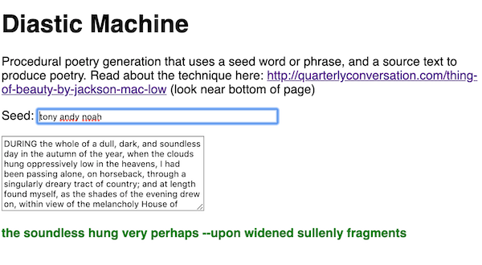

# 2 - Constrained Writing

## I. Overview

- Last time we looked at six! different ways to bring unstructured (plain) text into our JS applications
- We also looked at using various string operations to manipulate text, and built as a HW assignment built a "palindrome detector". Palindromes are an example of *Constrained Writing* - https://en.wikipedia.org/wiki/Constrained_writing - which is a literary technique in which the writer is bound by some condition that forbids certain words or imposes a pattern
- Today we will look at another constrained writing technique for generating text that can be used as part of a creative work, the *Diastic method*


## II. Constrained writing techniques

Here a a few:
- The ["Cut up" and "Fold in" methods](http://www.writing.upenn.edu/~afilreis/88v/burroughs-cutup.html) - created by William Burroughs (who is best know for writing the novel [*Naked Lunch*](https://groveatlantic.com/book/naked-lunch/))
- Recall that we looked at Randomness during week 1 - [randomness-1.md](randomness-1.md) - and watched the video about the Dadaist Poem --> [Video - Dada: Chance & Randomness](https://youtu.be/k40U4UPiiPs?t=182)
- Erasure Poetry - https://en.wikipedia.org/wiki/Erasure_(artform) --> a well-known example of this is [Garfield Minus Garfield](http://garfieldminusgarfield.net)
- [Oulipo: N+7 at languageisavirus.com](http://www.languageisavirus.com/creative-writing-techniques/oulipo.php#.XHMH_S2ZPOR) - where words of a chosen text are replaced with their dictionary definitions:
  - example: http://www.spoonbill.org/n+7/
- There are many more listed here --> [http://www.languageisavirus.com](http://www.languageisavirus.com/creative-writing-techniques/index.php#.XHMIZC2ZPOQ)

<a id="III"></a>

## III. The Diastic method 
Today we'll build a "diastic machine" that will automate this creation process for us.

- The diastic method is a method for generating procedural text that was created by Jackson Mac Low. It generates output (a stream of words) which can form the basis of a finished poem or text.
- This output is derived from two inputs:
  - The first input is the *source text*, from which all of the words in the output are taken. In our example below it an excerpt from Poe's *The Fall of the House of Usher*
  - The second input is the *seed text*, typically a sentence or two in length. In our example below the seed is the first name's of this semster's 330 instructors
- The rules of diastic method are as follows (and can either be done "by hand", or with a computer as we are doing):
  - "The writer reads through the source text and successively finds words or other linguistic units that have the letters of the seed text in positions that correspond to those they occupy in the seed text."
  - "Like the Cubists, Surrealists and Dadaists before him, Mac Low has carved out a new space for poetry, a new space in which future poets may explore." 
  - The above quote and a nice example of how the technique works is here: http://quarterlyconversation.com/thing-of-beauty-by-jackson-mac-low
  

## IV. Demo

### IV-A. About the Demo
- The demo will use the following JS methods:
  - `string.trim()` - get rid of spaces on both ends of string
  - `string.toLowerCase()`
  - `string.replace(pattern,replacement)` - replaces occurences of `pattern` with `replacement`
  - `string.split(delimiter)` - turns a string into an array based on the `delimiter`
  - `string.charAt(index)` - returns the character at the specified `index`
- `string.replace()` often uses regular expressions for pattern matching - here's an online tool that is helpful - we will demo this in class: https://www.regextester.com/21


### IV-B. Done Version



- And here's a link to an improved version that generates multiple lines of poetry --> [Diastic Machine Plus](http://igm.rit.edu/~acjvks/courses/2019-spring/330/demos/diastic-machine-plus.html)

### IV-C. Start Code

**diastic-machine-start.html**

```html
<!DOCTYPE html>
<html lang="en">
<head>
	<meta charset="utf-8" />
	<title>Diastic Machine</title>
	<style>
		body{font-family:sans-serif;}
	</style>
</head>
<body>
<h1>Diastic Machine</h1>
<p>Procedural poetry generation that uses a seed word or phrase, and a source text to produce poetry. Read about the technique here: <a href="http://quarterlyconversation.com/thing-of-beauty-by-jackson-mac-low">http://quarterlyconversation.com/thing-of-beauty-by-jackson-mac-low</a> (look near bottom of page)</p>
<section>
	<p>Seed: <input id="seed" type="text" size="50" maxlength="50" autofocus value="tony andy noah" /></p>

	<p><textarea cols="40" rows="7">DURING the whole of a dull, dark, and soundless day in the autumn of the year, when the clouds hung oppressively low in the heavens, I had been passing alone, on horseback, through a singularly dreary tract of country; and at length found myself, as the shades of the evening drew on, within view of the melancholy House of Usher. I know not how it was --but, with the first glimpse of the building, a sense of insufferable gloom pervaded my spirit. I say insufferable; for the feeling was unrelieved by any of that half-pleasurable, because poetic, sentiment, with which the mind usually receives even the sternest natural images of the desolate or terrible. I looked upon the scene before me --upon the mere house, and the simple landscape features of the domain --upon the bleak walls --upon the vacant eye-like windows --upon a few rank sedges --and upon a few white trunks of decayed trees --with an utter depression of soul which I can compare to no earthly sensation more properly than to the after-dream of the reveller upon opium --the bitter lapse into everyday life --the hideous dropping off of the veil. There was an iciness, a sinking, a sickening of the heart --an unredeemed dreariness of thought which no goading of the imagination could torture into aught of the sublime. What was it --I paused to think --what was it that so unnerved me in the contemplation of the House of Usher? It was a mystery all insoluble; nor could I grapple with the shadowy fancies that crowded upon me as I pondered. I was forced to fall back upon the unsatisfactory conclusion, that while, beyond doubt, there are combinations of very simple natural objects which have the power of thus affecting us, still the analysis of this power lies among considerations beyond our depth. It was possible, I reflected, that a mere different arrangement of the particulars of the scene, of the details of the picture, would be sufficient to modify, or perhaps to annihilate its capacity for sorrowful impression; and, acting upon this idea, I reined my horse to the precipitous brink of a black and lurid tarn that lay in unruffled lustre by the dwelling, and gazed down --but with a shudder even more thrilling than before --upon the remodelled and inverted images of the gray sedge, and the ghastly tree-stems, and the vacant and eye-like windows.From that chamber, and from that mansion, I fled aghast. The storm was still abroad in all its wrath as I found myself crossing the old causeway. Suddenly there shot along the path a wild light, and I turned to see whence a gleam so unusual could have issued; for the vast house and its shadows were alone behind me. The radiance was that of the full, setting, and blood-red moon which now shone vividly through that once barely-discernible fissure of which I have before spoken as extending from the roof of the building, in a zig-zag direction, to the base. While I gazed, this fissure rapidly widened --there came a fierce breath of the whirlwind --the entire orb of the satellite burst at once upon my sight --my brain reeled as I saw the mighty walls rushing asunder --there was a long tumultuous shouting sound like the voice of a thousand waters --and the deep and dank tarn at my feet closed sullenly and silently over the fragments of the "HOUSE OF USHER."</textarea></p>
	<p id="output"></p>
</section>
<script>
let seed = document.querySelector("#seed");
let input = document.querySelector("textarea");
let output = document.querySelector("#output");

seed.oninput = doInput; 
input.oninput = doInput;
input.dispatchEvent(new Event("input")); // calls doInput() when the page first loads

function doInput(){
	// the `seedText` comes out of the <input>
	let seedText = seed.value.trim().toLowerCase();
	seedText = seedText.replace(/\s/g,''); // get rid of white space
	
	// the `words` array comes out of the <textarea>
	let text = input.value.trim().toLowerCase();
	let regex = /[\s,.!?]+/g;
	let words = text.split(regex); // split on spaces OR commas OR periods etc
	
	let outputText = text; // this will change
	// Do Diastic stuff below
	
	
	//
	output.innerHTML = outputText; 
}


</script>
</body>
</html>
```

### IV-D. Done Code

**diastic-machine-done.html**

```html
<!DOCTYPE html>
<html lang="en">
<head>
	<meta charset="utf-8" />
	<title>Diastic Machine</title>
	<style>
		body{font-family:sans-serif;}
	</style>
</head>
<body>
<h1>Diastic Machine</h1>
<p>Procedural poetry generation that uses a seed word or phrase, and a source text to produce poetry. Read about the technique here: <a href="http://quarterlyconversation.com/thing-of-beauty-by-jackson-mac-low">http://quarterlyconversation.com/thing-of-beauty-by-jackson-mac-low</a> (look near bottom of page)</p>
<section>
	<p>Seed: <input id="seed" type="text" size="50" maxlength="50" autofocus value="tony andy noah" /></p>

	<p><textarea cols="40" rows="7">DURING the whole of a dull, dark, and soundless day in the autumn of the year, when the clouds hung oppressively low in the heavens, I had been passing alone, on horseback, through a singularly dreary tract of country; and at length found myself, as the shades of the evening drew on, within view of the melancholy House of Usher. I know not how it was --but, with the first glimpse of the building, a sense of insufferable gloom pervaded my spirit. I say insufferable; for the feeling was unrelieved by any of that half-pleasurable, because poetic, sentiment, with which the mind usually receives even the sternest natural images of the desolate or terrible. I looked upon the scene before me --upon the mere house, and the simple landscape features of the domain --upon the bleak walls --upon the vacant eye-like windows --upon a few rank sedges --and upon a few white trunks of decayed trees --with an utter depression of soul which I can compare to no earthly sensation more properly than to the after-dream of the reveller upon opium --the bitter lapse into everyday life --the hideous dropping off of the veil. There was an iciness, a sinking, a sickening of the heart --an unredeemed dreariness of thought which no goading of the imagination could torture into aught of the sublime. What was it --I paused to think --what was it that so unnerved me in the contemplation of the House of Usher? It was a mystery all insoluble; nor could I grapple with the shadowy fancies that crowded upon me as I pondered. I was forced to fall back upon the unsatisfactory conclusion, that while, beyond doubt, there are combinations of very simple natural objects which have the power of thus affecting us, still the analysis of this power lies among considerations beyond our depth. It was possible, I reflected, that a mere different arrangement of the particulars of the scene, of the details of the picture, would be sufficient to modify, or perhaps to annihilate its capacity for sorrowful impression; and, acting upon this idea, I reined my horse to the precipitous brink of a black and lurid tarn that lay in unruffled lustre by the dwelling, and gazed down --but with a shudder even more thrilling than before --upon the remodelled and inverted images of the gray sedge, and the ghastly tree-stems, and the vacant and eye-like windows.From that chamber, and from that mansion, I fled aghast. The storm was still abroad in all its wrath as I found myself crossing the old causeway. Suddenly there shot along the path a wild light, and I turned to see whence a gleam so unusual could have issued; for the vast house and its shadows were alone behind me. The radiance was that of the full, setting, and blood-red moon which now shone vividly through that once barely-discernible fissure of which I have before spoken as extending from the roof of the building, in a zig-zag direction, to the base. While I gazed, this fissure rapidly widened --there came a fierce breath of the whirlwind --the entire orb of the satellite burst at once upon my sight --my brain reeled as I saw the mighty walls rushing asunder --there was a long tumultuous shouting sound like the voice of a thousand waters --and the deep and dank tarn at my feet closed sullenly and silently over the fragments of the "HOUSE OF USHER."</textarea></p>
	<p id="output"></p>
</section>
<script>
let seed = document.querySelector("#seed");
let input = document.querySelector("textarea");
let output = document.querySelector("#output");

seed.oninput = doInput; 
input.oninput = doInput;
input.dispatchEvent(new Event("input")); // calls doInput() when the page first loads

function doInput(){
	// the `seedText` comes out of the <input>
	let seedText = seed.value.trim().toLowerCase();
	seedText = seedText.replace(/\s/g,''); // get rid of white space
	
	// the `words` array comes out of the <textarea>
	let text = input.value.trim().toLowerCase();
	let regex = /[\s,.!?]+/g;
	let words = text.split(regex); // split on spaces OR commas OR periods etc
	
	let outputText = "";
	let currentWordIndex = 0;
	const maxWordLength = 8;
	// Do Diastic stuff below
	for(let i=0;i<seedText.length;i++){
		let c = seedText.charAt(i);
		for(let j=currentWordIndex; j< words.length; j++){
			if (words[j].toLowerCase().charAt(i%maxWordLength) == c){
				outputText += words[j] + " ";
				currentWordIndex = j + 1;
				break;
			}
		}
	}
	//
	output.innerHTML = outputText; 
}


</script>
</body>
</html>
```

<hr><hr>

**[Previous Chapter <- Loading Plain Text (Part I)](text-1.md)**

**[Next Chapter -> Simple Text Analysis (Part III)](text-3.md)**
