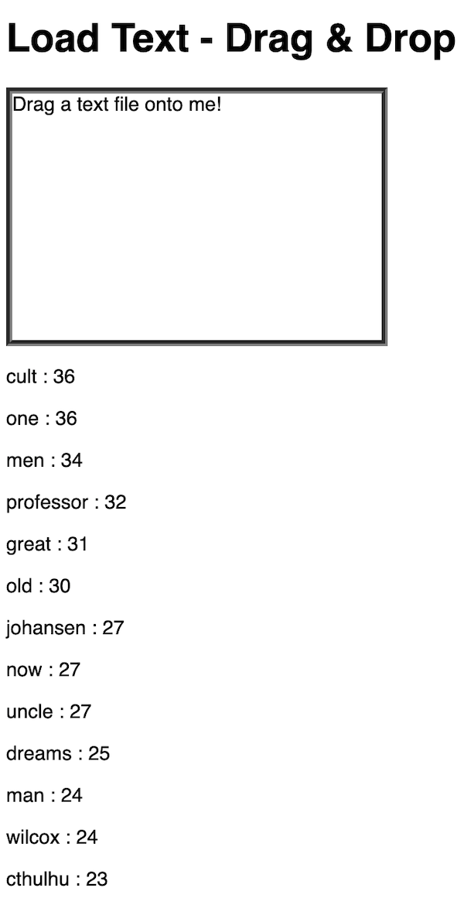

# 3 - Simple Text Analysis

## I. Overview
- Today we are going to write a simple word counting application that will analyze a loaded text and determine what the most common words in the page are.
- We will then filter out the "stop words" which are common words like pronouns (ex. "I", "you", "we") and prepositions (ex. "at", "on", "in") that don't tell us much about the contents or meaning of a block of text
- After we are finished with this demo, you will find that it it a nice starting point for your [HW-word-cloud.md](./HW-word-cloud.md) assignment

<hr>

## II. Lecture & Demo
- We are going to build a word counting application in class. This demo will be the basis for your [HW - Word Cloud](./HW-word-cloud.md) assignment
- The start file for the demo is [**load-text-drag-drop.html**](./text-1.md/#I-D)
- You will also need at least one text file for testing purposes - here are 2 that you can use --> [data.zip](./_files/data.zip)
- This demo will use these JS methods:
  - `string.split()`
  - `string.toLowerCase()`
  - `array.sort()`
  - `array.includes()`
  - `Object.keys()`
- For your copy-and-paste pleasure, here is the array of "stop words" we will need to remove from our text in order to determine what the most common keywords are in the text:

```js
const stopwords = ["a", "about", "above", "after", "again", "against", "all", "am", "an", "and", "any","are","aren't","as","at","be","because","been","before","being","below","between","both","but","by","can't","cannot","could","couldn't","did","didn't","do","does","doesn't","doing","don't","down","during","each","few","for","from","further","had","hadn't","has","hasn't","have","haven't","having","he","he'd","he'll","he's","her","here","here's","hers","herself","him","himself","his","how","how's","i","i'd","i'll","i'm","i've","if","in","into","is","isn't","it","it's","its","itself","let's","me","more","most","mustn't","my","myself","no","nor","not","of","off","on","once","only","or","other","ought","our","ours","ourselves","out","over","own","same","shan't","she","she'd","she'll","she's","should","shouldn't","so","some","such","than","that","that's","the","their","theirs","them","themselves","then","there","there's","these","they","they'd","they'll","they're","they've","this","those","through","to","too","under","until","up","very","was","wasn't","we","we'd","we'll","we're","we've","were","weren't","what","what's","when","when's","where","where's","which","while","who","who's","whom","why","why's","with","won't","would","wouldn't","you","you'd","you'll","you're","you've","your","yours","yourself","yourselves"];
```

- And here's some pseudocode:

```js
// 1- create an array of words from the loaded string

// 2 - loop through array:
	// A - get rid of stop words
	// B - get rid of numbers
	// C - get rid of 1 character words
        // D - count up frequency of each word and store values in a dictionary (i.e. Object)
  

// 3 - grab keys of dictionary and sort them by frequency of their "count" in the dictionary

// 4 - loop through sorted keys and display frequency of each word on page
```

- these links might come in handy:
  - https://www.regextester.com
  - https://www.rexegg.com/regex-quickstart.html

<hr>

## III. Done Version



<hr>

# IV. Videos

- [Demo: Word Counter Part A (17:24)](https://video.rit.edu/Watch/text-3-word-counter-part-A)
- [Demo: Word Counter Part B (06:57)](https://video.rit.edu/Watch/text-3-word-counter-part-B)

<hr><hr>

**[Previous Chapter <- Constrained Writing (Part II)](text-2.md)**

**[Next Chapter -> The RiTa.js Computational Text Library (Part IV)](text-4.md)**
