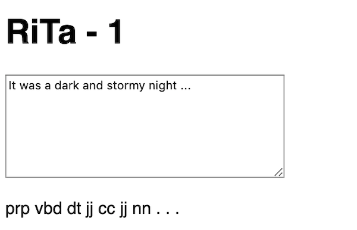
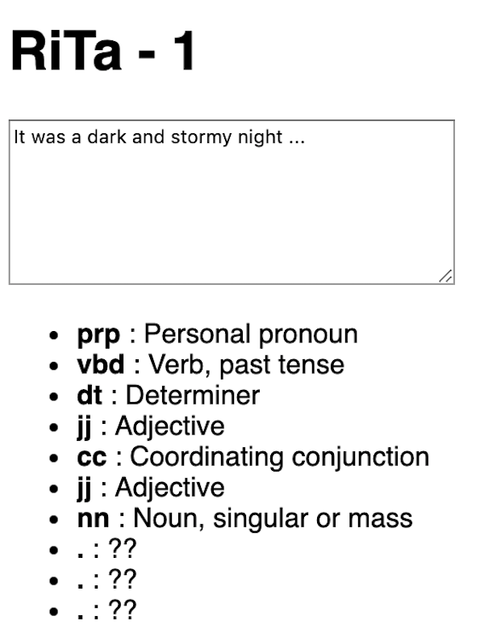
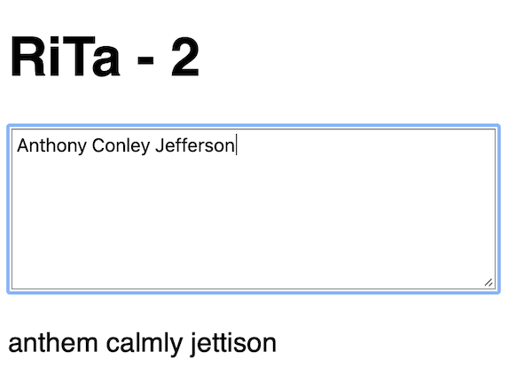
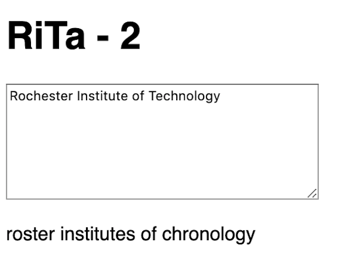
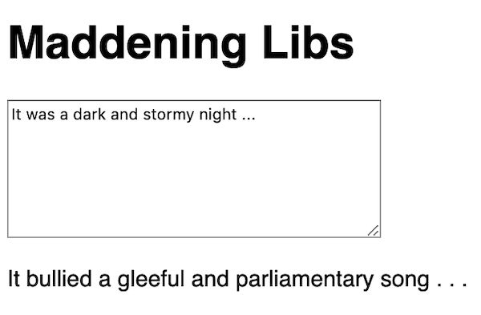
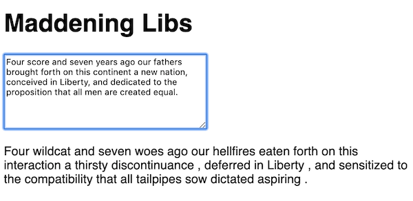

# 4 - The RiTa.js Computational Text Library

## I. Overview
- RiTa is a "software toolkit for computational literature"
- Documentation of the JavaScript version of RiTa is here: 
  - http://rednoise.org/rita/
  - http://rednoise.org/rita/reference/index.php
  - https://github.com/dhowe/RiTaJS
- Some of RiTa's capabilities:
  - *text tagging* - get the part of speech of a word - such as *adjective*, *verb*, *noun*, *proper noun*, *pronoun* etc  - from the PENN part of speech tags: http://rednoise.org/rita/reference/PennTags.html
    - https://en.wikipedia.org/wiki/Part-of-speech_tagging
  - *verb conjugation* and *pluralization*
  - *text generation* via context-free grammars
  
<hr>

## II. Demo

### II-A. Create the Demo File
- To follow along on the demo and have a start file for the Homework, go ahead and grab the **load-text-textarea.html** file we have at [text-1.md](text-1.md#I-B)
- Change the &lt;title> & &lt;h1> text to "RiTa - 1"
- name the file **rita-1.html**
- delete the `input.onchange = doChange;` line of JS, and the `doChange()` event handler (we don't need them)
- Now you need to import the RiTa.js library. There is a CDN for RiTa.ja here - look for the **rita-full.js** file here: https://cdnjs.com/libraries/rita - grab the URL and add a &lt;script> tag to the &lt;head> section of your start file
- Now open up the console - you should see the current version of RiTa logged out - something like `[INFO] RiTaJS.version [1.3.89]`

### II-B. The RiTa.js library

- We now have 7 top-level objects to work with: `RiTa`, `RiString`, `RiGrammar`, `RiMarkov`, `RiWordNet`, `RiLexicon` and `RiTaEvent`
- Let's type in each of the commands listed below into the console, in order to see that they do. The docs for all of the RiTa methods are here: http://rednoise.org/rita/reference/index.php
  - These commands use the RiTa *lexicon* - a lexicon is a set of words, and information about these words - their pronunication and part-of-speech for example. RiTa's lexicon is approximately 40,000 words - https://rednoise.org/rita/reference/RiLexicon.php
    - `RiTa.randomWord("nn")` - a random noun - full list of POS tags are here: http://rednoise.org/rita/reference/PennTags.html
    - `RiTa.rhymes("computer")`
    - `RiTa.pluralize("computer")`
    - `RiTa.singularize("people")`
    - `RiTa.alliterations("games")`
    - `RiTa.isRhyme("cat", "hat")`
    - `RiTa.similarByLetter("rochester")`
    - `RiTa.similarBySound("institute")`
    - `RiTa.similarBySoundAndLetter("technology")`
  
  - RiTa can also tell us about the parts of speech of a sentence:
     - `RiTa.isNoun("computer")`
     - `RiTa.isVerb("take")`
     - `RiTa.getPastParticiple("take")`
     - `RiTa.getPresentParticiple("take")`
     - `let rs = RiString("The elephant took a bite!")` - creates a [`RiString`](http://rednoise.org/rita/reference/RiString.php) object
     - `rs.analyze()` - lot's of info!
     - `rs._features.phonemes`
     - `rs._features.syllables`
     - `rs.pos()` - gets the parts-of-speech of the string in an array
     - `rs.posAt(1)` - gets the part-of-speech of the second word
     - `rs.words()` - tokenizes the sentence and puts the tokens into an array
     
### II-C. Part-of-speech "displayer"

- Now let's modify **rita-1.html** and try out some of these RiTa features we tried out above.
- What we would like to do is to display the part of speech for each word that is in the text area. This is pretty easy, here's what `doInput()` needs to look like:

```js
function doInput(e){
	let text = e.target.value;
	if (text.length == 0) return;
	let rs = RiString(text);
	let pos = rs.pos()
	
	let s = "";
	for(let item of pos){
		s += item + " ";
	}
	
	output.innerHTML = s;
}
```

- Which displays the PENN tags for you and looks something like this:



- So the first word is a personal pronoun, and the second word is a past tense verb and so on. Let's make this a little more human readable - here's a JavaScript dictionary (object) that has the full names for these tags - add this to your JS:

```js
const POS = {
	"cc":"Coordinating conjunction",
	"dt":"Determiner",
	"jj":"Adjective",
	"nn":"Noun, singular or mass",
	"prp":"Personal pronoun",
	"vbd":"Verb, past tense"
};
```

- Reminder - these POS tags are listed here: http://rednoise.org/rita/reference/PennTags.html
- You will also need to modify the loop to look like this:

```js
let s = "<ul>";
for(let item of pos){
  let desc = POS[item];
  if(desc == undefined) desc = "??"
  s += `<li><b>${item}</b> : ${desc}</li>`;
}
s += "</ul>";
output.innerHTML = s;
```

- Reload the page, here are the results:



- try typing in new words - you should see the part-of-speech tags appear for the new words. Obviously you will need to expand the `POS` dictionary to include all of the full names of these tags
- to get rid of the unwanted punctuation, add a call to `RiTa.isPunctuation()` for each `item`, and then `continue` if it returns `true`


### II-D. Proper Noun "replacer"

- How about trying to replace all of the proper nouns of a sentence with *similar* words pulled from RiTa?
- Make a copy of **rita-1.html** and name it **rita-2.html**
- Change the &lt;title> & &lt;h1> text to "RiTa - 2"
- Hints: 
  - use `RiString()` and `.words()` like we did in the console demo
  - the "similarBy" methods return an array - you need to pull out a random element of that array
  - you don't need the `POS` object anymore ...
- Give it a try - see below for examples:

<hr>





<hr>

<a id="III"></a>
 
## III. Homework Assignment - *Maddening Libs*

- Make a copy of **rita-2.html** and name it **maddening-libs.html**
- Change the &lt;title> & &lt;h1> text to "Maddening Libs"
- Modify the example above so that it will:
  - replace all nouns and plural nouns, with a random noun or random plural noun
  - replace all adjectives (there are 3 tags), with a random adjective of the same type
  - replace all verbs (there are 6 tags), with a random verb of the same type
- Hints: 
  - utilize the PENN part of speech tags from the page linked above
  - use [`RiTa.randomWord(pos)`](https://rednoise.org/rita/reference/RiTa/RiTa.randomWord/index.php) to get a random word of a particular part-of-speech
  - note that `randomWord('nnp')` always returns "chevrolet", and `randomWord('nnps')` returns an empty string.  This is because the RiTa.js dictionary does not have any other proper nouns in it, neither singular or plural. What to do about this? We'll leave it up to you - choose one of the following:
    - don't replace proper nouns 
    - replace proper nouns with a random word of a random part-of-speech - `RiTa.randomWord()` does that
    - replace proper nouns with a random regular (i.e. "common") noun
    - replace proper nouns with a word generated by one of the "similarBy..." methods
    - modify the RiTa.js dictionary and add some proper nouns to the lexicon that `RiTa.randomWord()` can utilize, either by editing a local copy of the library directly, or by using the [`RiTa.addWord()`](https://rednoise.org/rita/reference/RiTa/RiTa.addWord/index.php) method
  - after you get it working, you might want to use regular expressions to simplify your code (when dealing with similar POS tags)
  - alternatively, another approach might be to use [`array.includes()`](https://developer.mozilla.org/en-US/docs/Web/JavaScript/Reference/Global_Objects/Array/includes) (think about it)
- Here is a screen shot of an example:



**OR**



<hr>

## IV - Videos

- [Rita-1: Intro to Rita (12:08)](https://video.rit.edu/Watch/rita-js-1-intro)
- [Rita-2: Getting parts-of-speech (06:39)](https://video.rit.edu/Watch/rita-js-2-getting-parts-of-speech)
- [Rita-3: Proper noun replacer (07:57)](https://video.rit.edu/Watch/rita-js-3-proper-noun-replacer)

<hr><hr>

**[Previous Chapter <-  Simple Text Analysis (Part III)](text-3.md)**

**[Next Chapter -> Context Free Grammars (Part V)](text-5.md)**
