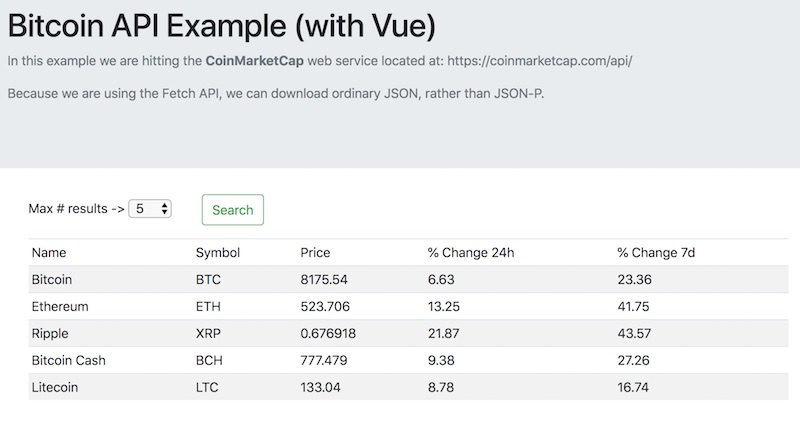
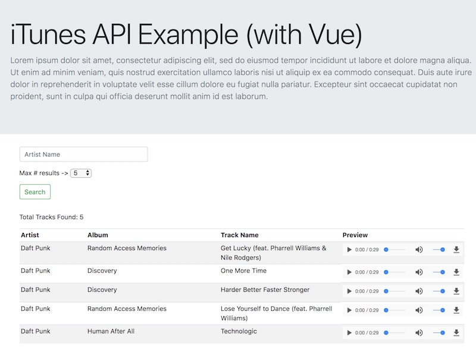

# Vue Part II - Ajax and Vue.js

## 0. Review
Let's browse some of the Vue.js documentation here: https://vuejs.org/v2/guide/index.html

## I. Overview
Today we will create a simple web service app using Vue.js and the Fetch API. This service will download a random joke from our PHP jokes web service located at: https://people.rit.edu/~acjvks/330/spring-2018/php-web-services/get-a-joke.php

## II. The Fetch API
The Fetch API is a newer browser API that allows us to download network resources. You can read about it here:

- https://developer.mozilla.org/en-US/docs/Web/API/Fetch_API/Using_Fetch
- https://developer.mozilla.org/en-US/docs/Web/API/Fetch_API
- https://developers.google.com/web/ilt/pwa/working-with-the-fetch-api

The Fetch API uses [Promises](https://developer.mozilla.org/en-US/docs/Web/JavaScript/Reference/Global_Objects/Promise), which make asynchronous callbacks easier to read, and help us avoid the callback pyramid of doom. You can read about Promises here: https://developer.mozilla.org/en-US/docs/Web/JavaScript/Guide/Using_promises


## III. CORS (Cross Origin Resource Sharing)
For security reasons, browsers restrict cross-origin HTTP requests initiated from within scripts. XMLHttpRequest and the Fetch API follow the same-origin policy. This means that a web application using those APIs can only request HTTP resources from the same domain the application was loaded from unless CORS headers are used.

In order to Fetch to work, we need to turn on Cross Origin Resource Sharing on our web service. 

- https://developer.mozilla.org/en-US/docs/Web/HTTP/CORS
- https://enable-cors.org/server_apache.html

1. To enable CORS, we need to add the following to the .htaccess file in the same folder as our PHP "Joke Server":

`Header set Access-Control-Allow-Origin "*"`

2. We can see that this works by checking the response headers from our web service in the browser web inspector - we should see `Access-Control-Allow-Origin: *` at the top of the header list.

## IV. Start File 

**vue-ajax-random-joke.html**
```html
<!DOCTYPE html>
<html lang="en">
<head>
	<meta charset="utf-8" />
	<title>Random Joke Getter!</title>
	<style>
		/* .myheader grabbed from Bootstrap's jumbotron example - https://getbootstrap.com/docs/4.0/examples/jumbotron/ */
		.myheader{
			background-color: #e9ecef;
			padding: 4rem 2rem;
			margin-bottom:2rem;
		}
		
		input.form-control{
			display: inline-block;
			width: 20rem;
			margin-right:1rem;
		}
		.search-row{
			margin-bottom:1rem;
		}
	</style>
</head>
<body>
<div id="app">
	<div class="myheader">
		<h1 class="display-5"></h1>
		<p class="lead text-muted">In this example we are hitting our random joke web service located at: https://people.rit.edu/~acjvks/330/spring-2018/php-web-services/get-a-joke.php.</p>
		<p class="text-muted">Because we are using the Fetch API, we can download ordinary JSON, rather than JSON-P.</p>
		<p class="text-muted">But to do this with Fetch, we needed to first handle the CORS issue by setting the <code>Access-Control-Allow-Origin</code> header on banjo.</p>
	</div>			
	
	<div class="container">
		<div class="row search-row">
			<div class="col-md-12">
				<input class="form-control" placeholder="This input does nothing for now">
				<button class="btn btn-outline-success" type="submit">Search</button>
			</div>
		</div> <!-- end row -->
		
		<div class="row">
			<div class="col-md-12">
			<!-- joke goes here -->
			</div>
		</div> <!-- end row -->
	</div> <!-- end container -->	
</div> <!-- end #app -->

<script src="https://cdn.jsdelivr.net/npm/vue/dist/vue.js"></script>
<script>
const app = new Vue({
	el: '#app',
	data: {
	},
	methods:{
	search(){
		//if (! this.term.trim()) return;
		fetch("https://people.rit.edu/~acjvks/330/spring-2018/php-web-services/get-a-joke.php")
		.then(response => {
			if(!response.ok){
				throw Error(`ERROR: ${response.statusText}`);
			}
			return response.json();
		})
		.then(json => {	
			console.log(json);
		})
	   } // end search
	} // end methods
});

</script>
</body>
</html>
```

## V. Walkthrough

The basics are done here, but there is still some work left to get it functioning and looking better:

1. Go ahead and test the `methods: search()` method by typing `app.search()` in the console
1. Download the Bootstrap styles from their CDN like we did last time - get the links here: https://bootstrap-vue.js.org/docs - now the page should look much better!
1. Add some text to the &lt;h1> using a `data` property
1. Get the search button working
1. Display the result on the page (instead of just in the console)
1. Use `data.created()` [lifecycle hook](https://vuejs.org/v2/api/#Options-Lifecycle-Hooks) to call the `search()` method when the app first loads.


## VI. Homework
- Using our random joke app as a start file:
    - Get it working with the Crypto Currency web service we used last week - https://coinmarketcap.com/api/ - be sure to display at least 3 properties from each result (Crypto name, Crypto symbol, Crypto price, etc ...) **+5 points for adding a &lt;select> that limits the number of results**
    - **Extra Credit (worth one HW assignment):** get it working with the iTunes web service, and make sure that the user can search the service by typing in search terms - https://affiliate.itunes.apple.com/resources/documentation/itunes-store-web-service-search-api/ - and be sure to display at least 3 properties from each result (artist, track name, etc ...)

Hint:
- You will be getting back *arrays* of results from these services, instead of just a single result as you did with the random joke service.
- `<table class="table table-striped table-sm">...</table>` - gives a pretty nice Bootstrap striped table

## VII. Homework Examples

### Example Screenshot *CoinMarketCap* API



### Example Screenshot *iTunes Search* API



<hr><hr>

**[Previous Chapter <- Vue Part I](vue-1.md)**

**[Next Chapter -> Vue Part III](vue-3.md)**
