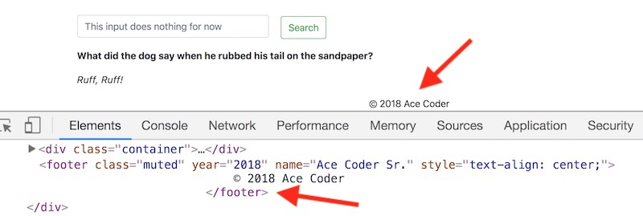
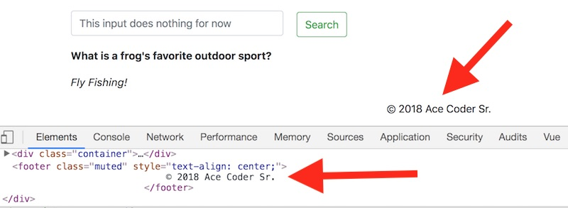

# Vue Part III - Simple Vue Components

## I. Overview & Example

- Components are reusable Vue instances with a name.
- Here's an example we can try out on our "random joke" Vue app :

```js
Vue.component('joke-footer',{
	template: `<footer class="muted" style="text-align:center">
		   &copy; 2018 Ace Coder
		   </footer>`
});
```

- Here we have registered a component named `joke-footer`
- note that we are using back-ticks \`...\` (ES6 template literals) to enclose the template string. These are handy because they can contain double-quotes without the need for escaping, and also display nicely on multiple lines.
- Go ahead and add this component to the joke app's HTML, right before the closing `#root` &lt;div>, by adding this to the page:

`<joke-footer></joke-footer>`

- Reload the page, Vue will render the `<joke-footer></joke-footer>` element into the contents of the template. If you inspect the HTML, you will see that `<joke-footer></joke-footer>` has been replaced by the valid HTML in our template: `<footer>© 2018 Ace Coder</footer>` 

**Screenshot**



## II. Passing parameters to components
- Of course, this component would be a lot more reusable and useful if we could pass in some arguments, say the name and year. Here's our new version, which uses the `props` property:

```js
Vue.component('joke-footer-2',{
	props: ['year','name'],
	template: `<footer class="muted" style="text-align:center">
		   &copy; {{ year }} {{ name }}
		   </footer>`
});
```

- `props` indicates the variable names that are going to be passed in
- now add this HTML to the page, and pass in `copyrightYear` and `copyrightName` variables

`<joke-footer-2 v-bind:year="copyrightYear" v-bind:name="copyrightName"></joke-footer-2>`

- reload the page - error! - now go ahead and define the `copyrightYear` and `copyrightName` properties on your `data` object.
- reload the page - it should now work - once again `<joke-footer-2></joke-footer-2>` has been replaced by a valid `<footer></footer>` element.

**Screenshot**



## III. Separation of Concern

To enable reuse of our component code on multiple pages, and more easily allow multiple people to work on this project, we should split this code out into multiple files.

- create a **src** folder
- move your Vue component code into a file named **vue-components.js**, and place this new file in the *src* folder
- move the rest of your Vue code into a file named **main.js**, and place this new file in the *src* folder
- link to these files from your HTML file like this:

```html
<script src="src/vue-components.js"></script>
<script src="src/main.js"></script>
```
- reload the HTML page, everything should work as before
- note that we aren't using ES6 modules here (but we could if we wanted to)


## IV. Discussion
- Do you understand *what* is happening *when* here:
  - in the screenshot above, when we "inspect" the DOM using the web inspector, we see the final version of the HTML that Vue rendered for us, and thus we see the &lt;footer> element.
  - but if we do "View Source" in the browser, we see the HTML that was originally loaded by the browser, prior to Vue processing it. This means we will see our custom &lt;joke-footer-2> element.

## V. Homework Exercise
- Now add a `<joke-display>` component to "random jokes" that will render the joke text inside of an HTML template
- Hints:
  - you will only need to pass in a single `joke` parameter 
  - the HTML within a Vue template is only allowed to have a **single root element**, to meet this requirement you can wrap the paragraph tags inside of a &lt;div>
- ZIP and Post to mycourses


## VI. Reference Links
- https://vuejs.org/v2/guide/components.html
- https://vuejs.org/v2/api/#Vue-component


<hr><hr>

**[Previous Chapter <- Vue Part II](vue-2.md)**

**[Next Chapter -> Vue Part IV](vue-4.md)**
