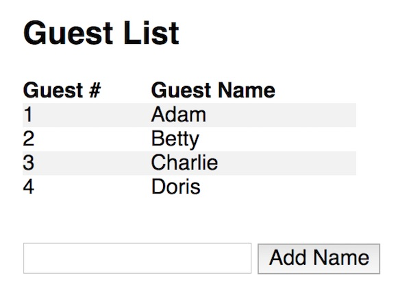
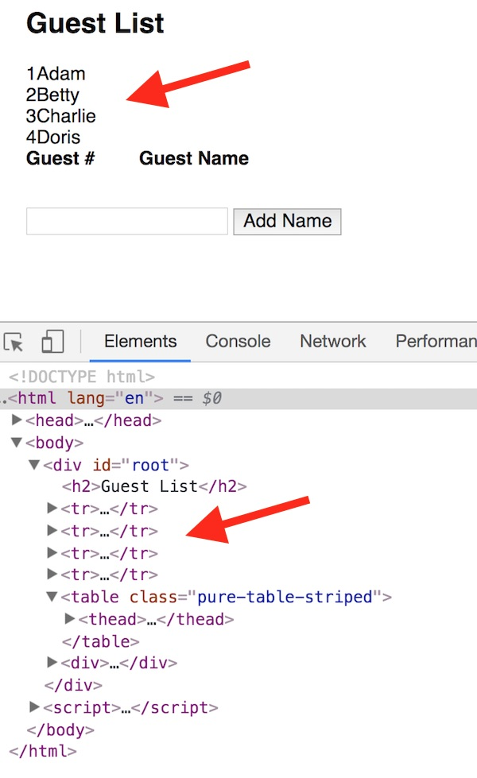
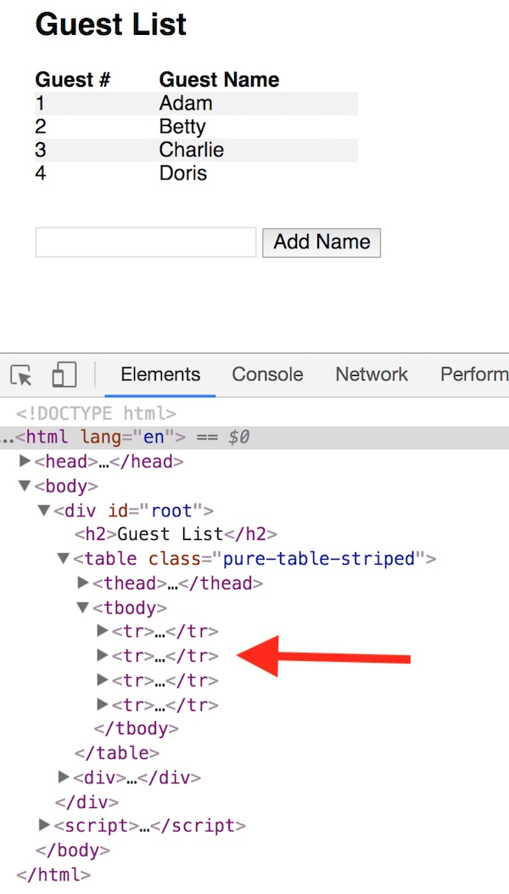

# Vue Part IV - Nested Components

## I. Overview
Here we will look at creating *nested* components - for example a `<list-item>` component that is located inside of a `<person-list>` component.

## II. Get started

For this example's start code, we will re-use some of our earlier Vue code, and display the data using an HTML table:

**friend-lister.html**

```html
<!DOCTYPE html>
<html lang="en">
<head>
	<meta charset="utf-8" />
	<title>Friend Lister</title>
	<!-- 	Pure.css -->
	<link rel="stylesheet" href="https://unpkg.com/purecss@1.0.0/build/pure-min.css" integrity="sha384-nn4HPE8lTHyVtfCBi5yW9d20FjT8BJwUXyWZT9InLYax14RDjBj46LmSztkmNP9w" crossorigin="anonymous">
	<!-- Development Version of Vue -->
	<script src="https://cdn.jsdelivr.net/npm/vue/dist/vue.js"></script>
	<style>
		#root{
			margin: 1em 2em;
		}
		table{
			width:250px;
			margin-bottom: 2em;
		}
		th{
			text-align:left;
		}
	</style>
</head>
<body>
<div id="root">
	<table class="pure-table-striped">
		<thead><th>Guest #</th><th>Guest Name</th></thead>
		<tr v-for="(name,index) in names">
			<td>{{ index + 1}}</td>
			<td v-text="name"></td>
		</tr>
	</table>
	<div>
		<!-- Check out the .trim qualifier - https://vuejs.org/v2/guide/forms.html#trim -->
		<input type="text" v-model.trim="newName">
		<button @click="addName">Add Name</button>
	</div>
</div>

<script>

let app = new Vue({
	el: '#root',
	data: {
		newName: "",
		names: ["Adam","Betty","Charlie","Doris"]
	},
	methods:{
		addName(){
			if (!this.newName) return;
			this.names.push(this.newName);
			this.newName = "";
		}
	}
});


</script>
</body>
</html>
```

### Screenshot of initial working version




## III. Create a table row component

Let's first turn just our table row (&lt;tr>) into a &lt;friend-list-row> component.

### III-A. Here's what the row component looks like:

```js
Vue.component('friend-list-row',{
	props: ['name','index'],
	template: `<tr>
			<td>{{ index + 1}}</td>
			<td v-text="name"></td>
		   </tr>`
});
```

### III-B. Using &lt;friend-list-row>

Get rid of the old "row" HTML code and replace it with this:

```js
<friend-list-row v-for="(name,index) in names" v-bind:name="name" v-bind:index="index"></friend-list-row>
```

### III-C. But the results looks like this!:



- The table rows have been placed *outside* of the table - what gives?
- What happened: the browser has very specific rules about which elements are allowed inside of a &lt;table>, and &lt;friend-list-row> tags are not on the list, so they are "hoisted" out of the &lt;table> by the browser.
- The browser does this *before* Vue gets to do its rendering, which means that when Vue actually does the render, the table row tags will be created in the wrong place.

### III-D. The fix

- Replace the `<friend-list-row></friend-list-row>` code with this

`<tr is="friend-list-row" v-for="(name,index) in names" v-bind:name="name" v-bind:index="index"></tr>`

- The `is` attribute here is where we specify the component (element) we wish to use
- Can you think of other situations where the browser will "hoist" elements before Vue can render them?


### Screenshot of fixed version




## IV. Nesting a component

### IV-A. Creating the &lt;friend-list> component

This is fairly straight forward - here is the new component we need to replace the &lt;h1> and &lt;table>:

```js
Vue.component('friend-list',{
props:['names'],
template: `<div>
		<h2>Guest List</h2>
		<table class="pure-table-striped">
		  <thead><th>Guest #</th><th>Guest Name</th></thead>
		  <tr is="friend-list-row" v-for="(name,index) in names" v-bind:name="name" v-bind:index="index"></tr>
		</table>
	  </div>`
});
```
 - here &lt;friend-list> is using the &lt;friend-list-row> component that we defined earlier
 - note that we need to wrap the template in a &lt;div> again, because of the "one root element" requirement
 
 ### IV-B. Using the &lt;friend-list> component
 - this should do it: `<friend-list v-bind:names="names"></friend-list>`
 - reload the page, it should work exactly as before


## V. Homework (Easy!)
- add a `title` "prop" to the &lt;friend-list> component, and display the value of that in the &lt;h2>. 
- test it by sending in a custom title (a `data` property) through `v-bind`
- move the component and Vue code to separate files like we did in the previous chapter
- ZIP and post to the dropbox

<hr><hr>

**[Previous Chapter <- Vue Part III](vue-3.md)**
